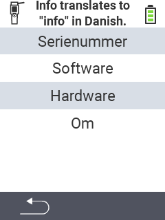

{}
Hvis du klikker på et menupunkt, bliver du omdirigeret til en beskrivelse af den respektive funktion.
{}

<map name="workmap">
  <area shape="rect" coords="2,40,238,80" alt="Serienummer" title="For at hente serienummeret på din enhed, klik her&#10;Mausklick: zur Dokumentation" href="/en/docs/device/info/serial-number/">
  <area shape="rect" coords="2,80,238,120" alt="Software" title="Instruktionerne til at se din softwareversion kan findes her&#10;Mausklick: zur Dokumentation" href="/en/docs/firmware/versions/">
  <area shape="rect" coords="2,120,238,160" alt="Hardware" title="For at få adgang til hardwareinformationen på din enhed, klik her&#10;Mausklick: zur Dokumentation" href="/en/docs/device/info/hardware/">
  <area shape="rect" coords="2,160,238,200" alt="Om" title="Hent leverandøroplysninger&#10;Mausklick: zur Dokumentation" href="/en/docs/device/info/about/">

  <area shape="rect" coords="2,282,120,319" alt="Tilbage" title="Hop tilbage på niveau&#10;Mouse click: open documentation" href="/en/docs/device/">
</map>
