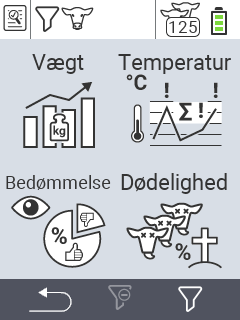

{}
Hvis du klikker på et menupunkt, bliver du omdirigeret til en beskrivelse af den respektive funktion.
{}

<map name="workmap">
  <area shape="rect" coords="3,40,116,160" alt="Vægt" title="Evaluer dine gemte data i Vægt sektionen&#10;Museklik: åbn dokumentation" href="/en/docs/evaluation/weight/">
  <area shape="rect" coords="3,160,116,279" alt="Bedømmelse" title="Evaluer dine gemte data i bedømmelses sektionen&#10;Museklik: åbn dokumentation" href="/en/docs/evaluation/rating/">

  <area shape="rect" coords="116,40,238,160" alt="Temperatur" title="Evaluer dine gemte data i Temperatur sektionen&#10;Museklik: åbn dokumentation" href="/en/docs/evaluation/temperature/">
  <area shape="rect" coords="116,160,238,279" alt="Dødelighed" title="Evaluer dine gemte data i dødeligheds sektionen&#10;Museklik: åbn dokumentation" href="/en/docs/evaluation/mortality/">

  <area shape="rect" coords="150,282,238,319" alt="Filter" title="Indstil et filter&#10;Museklik: til dokumentationen" href="/en/docs/filter">
  <area shape="rect" coords="2,282,95,319" alt="Tilbage" title="Hop tilbage et niveau&#10;Museklik: til dokumentationen" href="/en/docs/menu/mainmenu/">
</map>
