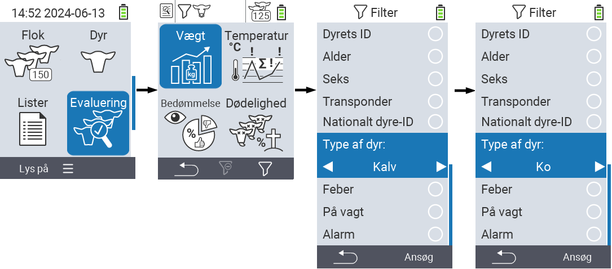
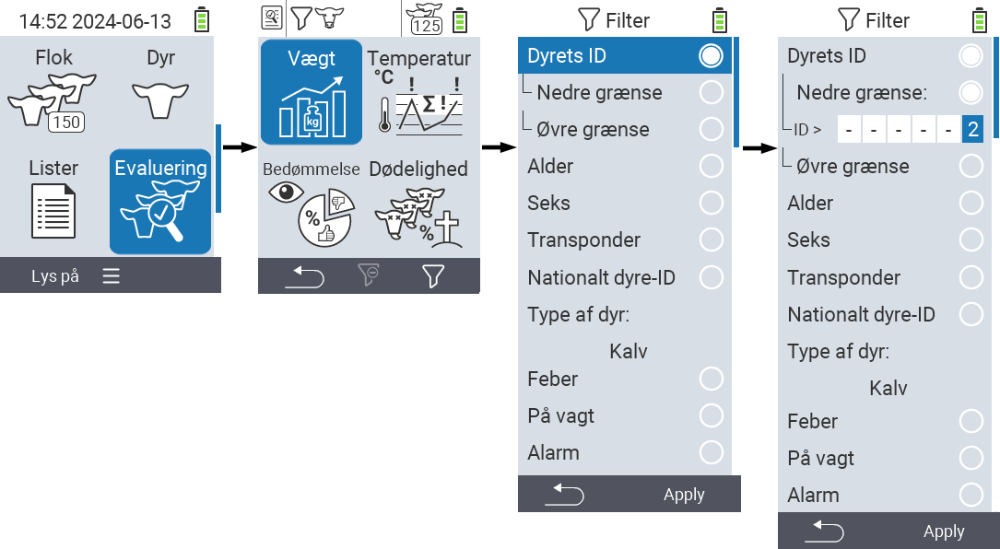
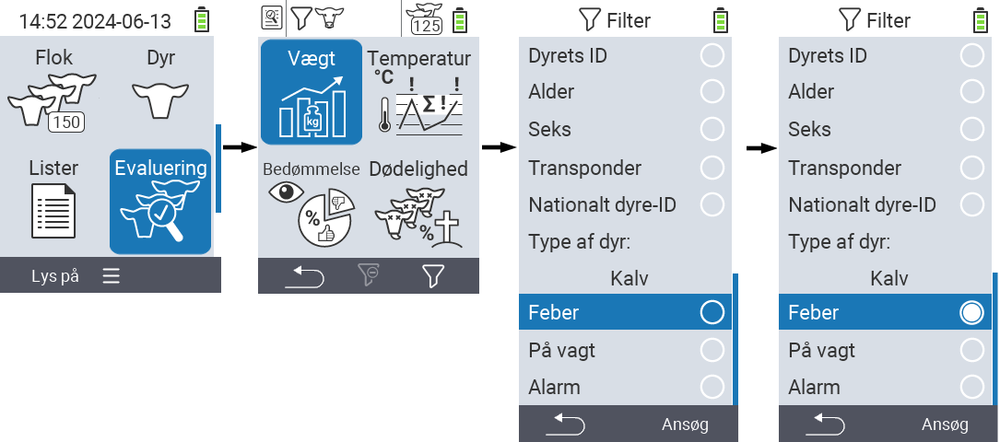

## Anvendelse af filtre {#applying-filters}

{}
Filteret hjælper dig med at foretage et valg ved hjælp af filterkriterier inden for menupunkterne ``, `` og `` på VitalControl-enheden. Så snart du anvender et filter, vises symboler for de forskellige filterkriterier øverst på skærmen. Disse symboler bruges til at hjælpe dig med at finde ud af, om og hvilke filterkriterier der er aktiveret. For eksempel, hvis du indstiller `` filteret til han, vil enheden kun bruge han-dyr. For eksempel, hvis du også aktiverer `` filteret, bruger enheden kun han-dyr, der er på observationslisten.
{}

For at oprette et filter i evalueringerne, skal du gøre følgende:

1. I undermenuen tilhørende det øverste menupunkt  `` tryk på `F3` tasten  én gang. Inde i undermenuen tilhørende de øverste menupunkter  `` og  ``, skal du trykke på tasten to gange.

2. En undermenu åbnes, hvor du kan indstille alle filtermuligheder. Du kan filtrere efter ``, ``, ``, ``, ``, ``, ``, `` og ``.

3. For filtrene ``, ``, `` og `` naviger til det tilsvarende område og bekræft med ``. Brug piletasterne ◁ ▷ til at angive den ønskede indstilling. Brug `F3` tasten `` for at sætte den valgte indstilling på plads. For at kassere dine filterændringer, tryk på `F1` tasten &nbsp;&nbsp;.

4. For filtrene `` og `` vælg det tilsvarende kriterium og bekræft med ``. Du vil nu blive vist en nedre og øvre grænse. Naviger til den ønskede grænse ved hjælp af piletasterne △ ▽ og bekræft ved at trykke `` to gange. Nu kan du indstille det ønskede tal ved hjælp af piletasterne ◁ ▷ og piletasterne △ ▽. Når alle indstillinger er korrekte, tryk `` igen for at forlade indstillingsmodus og anvende det valgte filter/de valgte filtre med `F3` tasten ``. Ved at bruge `F1` tasten &nbsp;&nbsp;, kan du kassere dine ændringer, hvis det ønskes.

5. For filtrene ``, `` og `` er der mulighed for at deaktivere eller aktivere deres anvendelse. For at gøre dette, vælg det tilsvarende filter og bekræft med ``. Filteret er nu aktivt. Bekræft igen med `` for at deaktivere filteret.

6. Når du har indstillet alle filtrene, brug `F3` tasten `` for at sætte de definerede filtre i kraft eller tryk `F1` tasten  for at kassere dine ændringer til filteret/filtrene.
