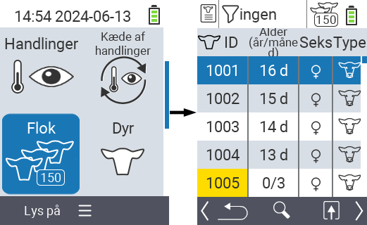
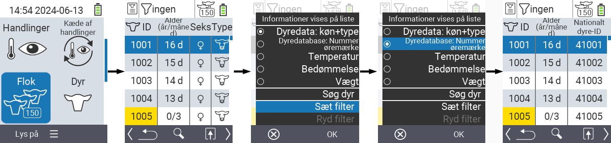
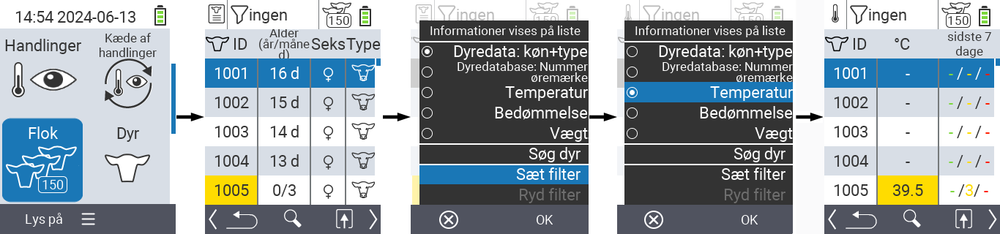
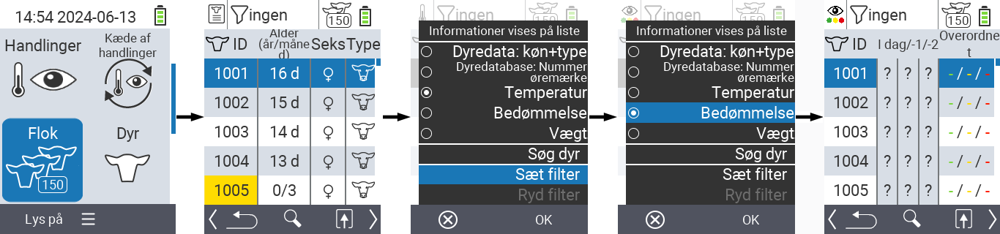
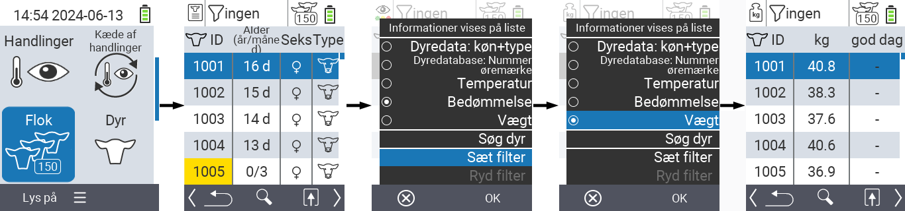
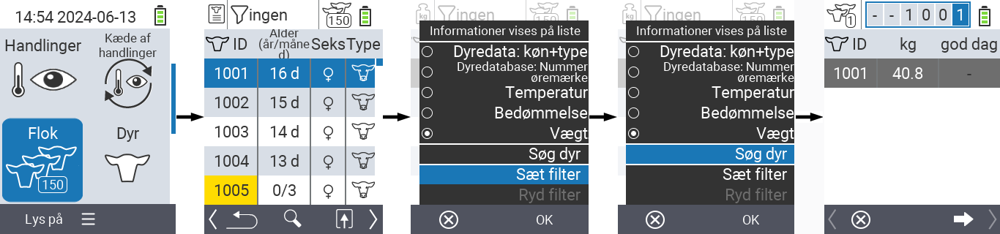
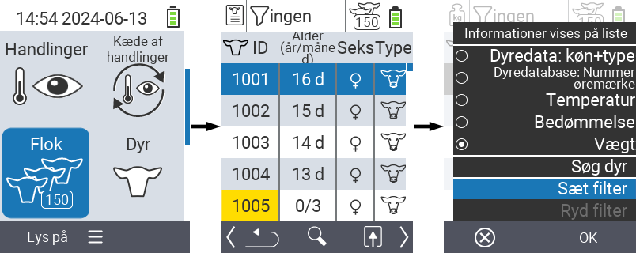
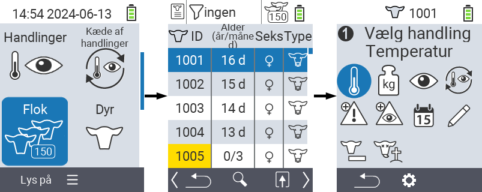

## Besætning {#herd}

Inden for menuen Besætning kan du se hele din besætning, søge efter individuelle dyr og vise vigtige oplysninger. Du har følgende muligheder:

- Se [dyredata](#view-animal-data)
- Se [temperaturdata](#display-temperature)
- Se [bedømmelsesdata](#view-rating)
- Se [vægtdata](#view-rating)
- [Søg dyr](#search-animal)
- Sæt [filter](#set-filter)
- [Handlinger](#call-action-menu)

### Forberedende trin {#preparatory-steps}

1. På hovedskærmen på din VitalControl-enhed skal du vælge menuen  `` og trykke på `` knappen.

2. Din besætningsoversigt åbnes.

    

### Se dyredata {#view-animal-data}

1. Fuldfør de forberedende trin.

2. Brug `F3` tasten &nbsp;&nbsp; for at åbne en popup-menu, der viser de informationskategorier, der kan vises for besætningslisten. Brug piletasterne △ ▽ til at fremhæve linjen `` eller `` og vælg denne kategori ved at trykke på den centrale `` knap eller `F3` tasten ``. De to valgmuligheder adskiller sig i visningen af informationslinjen.

3. Dyredata vil nu blive vist som indhold af besætningslisten.

4. Alternativt kan du bruge piletasterne ◁ ▷ til at skifte mellem de forskellige visningsmuligheder.

    

{}
Som standard vises dyredata først. Kun når du har vægten vist, for eksempel, skal du indstille visningen af dyredata igen.
{}

### Vis temperatur {#display-temperature}

1. Fuldfør de forberedende trin.

2. Brug `F3` tasten &nbsp;&nbsp; for at fremkalde en popup-menu, der viser de informationskategorier, der kan vises for besætningslisten. Brug piletasterne △ ▽ for at fremhæve linjen `` og vælg denne kategori ved at trykke på den centrale `` knap eller `F3` tasten ``.

3. Temperaturdata vil nu blive vist som indhold af besætningslisten.

4. Alternativt kan du bruge piletasterne ◁ ▷ for at skifte mellem de forskellige visningsmuligheder.

    

### Vis vurdering {#view-rating}

1. Fuldfør de forberedende trin.

2. Brug `F3` tasten &nbsp;&nbsp; for at fremkalde en popup-menu, der viser de informationskategorier, der kan vises for besætningslisten. Brug piletasterne △ ▽ for at fremhæve linjen `` og vælg denne kategori ved at trykke på den centrale `` knap eller `F3` tasten ``.

3. Vurderingsdata vil nu blive vist som indhold af besætningslisten.

4. Alternativt kan du bruge piletasterne ◁ ▷ for at skifte mellem de forskellige visningsmuligheder.

    

### Vis vægt {#display-weight}

1. Fuldfør de forberedende trin.

2. Brug `F3` tasten &nbsp;&nbsp; for at fremkalde en popup-menu, der viser de informationskategorier, der kan vises for besætningslisten. Brug piletasterne △ ▽ for at fremhæve linjen `` og vælg denne kategori ved at trykke på den centrale `` knap eller `F3` tasten ``.

3. Vægtd data vil nu blive vist som indhold af besætningslisten.

4. Alternativt kan du bruge piletasterne ◁ ▷ for at skifte mellem de forskellige visningsmuligheder.

    

### Søg dyr {#search-animal}

1. Fuldfør de forberedende trin.

2. Brug `F3` tasten &nbsp;&nbsp; for at fremkalde en popup-menu, der viser forskellige muligheder. Brug piletasterne △ ▽ til at fremhæve funktionen `` og aktiver søgefunktionen ved at trykke på den centrale `` tast eller `F3` tasten ``. Alternativt kan du bruge `On/Off` knappen  umiddelbart efter trin et.

3. Brug piletasterne △ ▽ ◁ ▷ til at indtaste det ønskede dyrenummer og bekræft med ``.

    

### Indstil filter {#set-filter}

1. Fuldfør de forberedende trin.

2. Brug `F3` tasten &nbsp;&nbsp; for at fremkalde en popup-menu, der viser forskellige muligheder. Brug piletasterne △ ▽ til at fremhæve funktionen `` og aktiver filterfunktionen ved at trykke på den centrale `` tast eller `F3` tasten ``.

3. Hvordan man anvender filteret kan findes [her]().

    

### Kald handlingsmenu {#call-action-menu}

Du har altid mulighed for at kalde handlingsmenuen for et dyr.

1. Fuldfør de forberedende trin.

2. Vælg et dyr fra listen med piletasterne △ ▽ og bekræft med ``.

3. Handlingsmenuen er nu åben. Hvordan man bruger denne kan findes [her](../actions).

4. Vend tilbage til besætningslisten med `F3` tasten.

    
