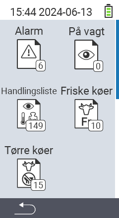

{}
Hvis du klikker på et menupunkt, bliver du omdirigeret til en beskrivelse af den respektive funktion.
{}

<map name="workmap">
  <area shape="rect" coords="3,40,116,160" alt="Alarm liste" title="Tjek din alarm liste&#10;Museklik: åbn dokumentation" href="/en/docs/lists/alarm/">
  <area shape="rect" coords="3,160,116,280" alt="Handlingsliste" title="Tjek din handlingsliste&#10;Museklik: åbn dokumentation" href="/en/docs/lists/actions/">
  <area shape="rect" coords="3,280,116,399" alt="Tørre køer liste" title="Tjek din liste over tørre køer&#10;Museklik: åbn dokumentation" href="/en/docs/lists/dry-cows/">

  <area shape="rect" coords="116,40,230,160" alt="På overvågningsliste" title="Tjek din overvågningsliste&#10;Museklik: åbn dokumentation" href="/en/docs/lists/on-watch/">
  <area shape="rect" coords="116,160,230,280" alt="Friske køer" title="Tjek din liste over friske køer&#10;Museklik: åbn dokumentation" href="/en/docs/lists/fresh-cows/">

  <area shape="rect" coords="2,401,115,438" alt="Tilbage" title="Gå et niveau tilbage" href="/en/docs/menu/mainmenu/">
</map>
