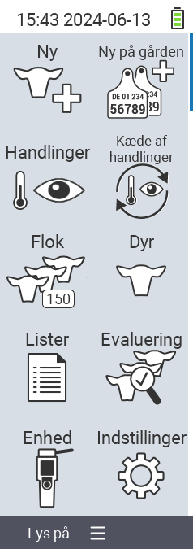

{}
Hvis du klikker på et menupunkt, bliver du omdirigeret til en beskrivelse af den respektive funktion.
{}

<map name="workmap">
  <area shape="rect" coords="3,40,116,160" alt="Ny" title="Opret nye dyr&#10;Museklik: åbn dokumentation" href="/da/docs/new/">
  <area shape="rect" coords="3,160,116,280" alt="Handlinger" title="Handlinger på dyr&#10;Museklik: åbn dokumentation" href="/da/docs/actions/">
  <area shape="rect" coords="3,280,116,400" alt="Besætning" title="Besætningsmenu&#10;Museklik: åbn dokumentation" href="/da/docs/herd/">
  <area shape="rect" coords="3,400,116,520" alt="Lister" title="Dyrelister&#10;Museklik: åbn dokumentation" href="/da/docs/lists/">
  <area shape="rect" coords="3,520,116,634" alt="Enhed" title="Enhed&#10;Museklik: åbn dokumentation" href="/da/docs/device/">

  <area shape="rect" coords="116,40,230,160" alt="Ny på gården" title="Adgang til dyr&#10;Museklik: åbn dokumentation" href="/da/docs/new-on-farm/">
  <area shape="rect" coords="116,160,230,280" alt="Handlingskæde" title="Handlingskæde&#10;Museklik: åbn dokumentation" href="/da/docs/chain-of-actions/">
  <area shape="rect" coords="116,280,230,400" alt="Dyr" title="Dyr&#10;Museklik: åbn dokumentation" href="/da/docs/animal/">
  <area shape="rect" coords="116,400,230,520" alt="Evaluering" title="Evaluering&#10;Museklik: åbn dokumentation" href="/da/docs/evaluation/">
  <area shape="rect" coords="116,520,230,634" alt="Indstillinger" title="Indstillinger&#10;Museklik: åbn dokumentation" href="/da/docs/settings/">
</map>
