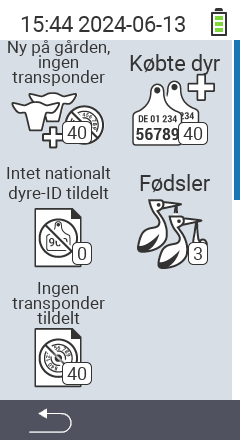

{}
Hvis du klikker på et menupunkt, bliver du omdirigeret til en beskrivelse af den respektive funktion.
{}

<map name="workmap">
  <area shape="rect" coords="3,40,116,160" alt="Ny på gården, ingen transponder" title="Her tildeler du en transponder til nye dyr uden en transponder&#10;Museklik: åbn dokumentation" href="/da/docs/new-on-farm/new-no-transponder/">
  <area shape="rect" coords="3,160,116,280" alt="Ingen nationalt dyre-ID tildelt" title="Her kan du se alle dyr, der endnu ikke er blevet tildelt et nationalt dyre-ID og tildele et nationalt dyre-ID&#10;Museklik: åbn dokumentation" href="/da/docs/new-on-farm/no-national-animal-id-assigned/">
  <area shape="rect" coords="3,280,116,399" alt="Ingen transponder tildelt" title="Her kan du se alle dyr, der endnu ikke er blevet tildelt en transponder og tildele dem en transponder&#10;Museklik: åbn dokumentation" href="/da/docs/new-on-farm/no-transponder-assigned/">

  <area shape="rect" coords="116,40,230,160" alt="Købte dyr" title="Her kan du se dine nuværende køb og eksportere dataene&#10;Museklik: åbn dokumentation" href="/da/docs/new-on-farm/purchased-animals/">
  <area shape="rect" coords="116,160,230,280" alt="Fødsler" title="Her kan du se dine fødsler og oprette en eksportfil&#10;Museklik: åbn dokumentation" href="/da/docs/new-on-farm/births/">
  <area shape="rect" coords="1,401,100,439" alt="Tilbage" title="Hop tilbage et niveau&#10;Museklik: til dokumentationen" href="/da/docs/menu/mainmenu/">
</map>
