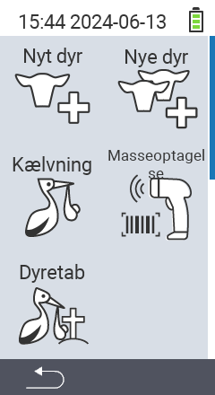

Via hovedmenuens punkt  `` kommer du til en undermenu, hvor 5 underpunkter præsenteres til valg:

<map name="workmap">
  <area shape="rect" coords="3,40,116,160" alt="Nyt dyr" title="Sådan registrerer du et nyt dyr ved hjælp af VitalControl-enheden&#10;Musseklik: åben dokumentation" href="/da/docs/new/animal/">
  <area shape="rect" coords="3,160,116,280" alt="Kælvning" title="Sådan registrerer du en ny kælvning ved hjælp af VitalControl-enheden&#10;Musseklik: åben dokumentation" href="/da/docs/new/calving/">
  <area shape="rect" coords="3,280,116,399" alt="Dyretab" title="Sådan registrerer du tabet af et dyr ved hjælp af VitalControl-enheden&#10;Musseklik: åben dokumentation" href="/da/docs/new/animal-loss/">

  <area shape="rect" coords="116,40,230,160" alt="Nye dyr" title="Sådan opretter du flere nye dyr på VitalControl-enheden ved hjælp af en enkelt handling&#10;Musseklik: åben dokumentation" href="/da/docs/new/animals/">
  <area shape="rect" coords="116,160,230,280" alt="Masseoptagelse" title="Brug stregkodescanneren til at registrere en række dyr&#10;Musseklik: åben dokumentation" href="/da/docs/new/bulk-recording/">

  <area shape="rect" coords="1,401,100,439" alt="Tilbage" title="Hop et niveau tilbage&#10;Musseklik: til dokumentationen" href="/da/docs/menu/mainmenu/">
</map>

{}
Hver undermenu har sit eget ikon. Flyt musemarkøren over et ikon i grafikken ovenfor og lad den hvile et øjeblik. En værktøjstip vises, der viser information for den valgte undermenu. Hvis du klikker på et af ikonerne, bliver du videresendt til en beskrivelse af det valgte undermenupunkt.
{}

