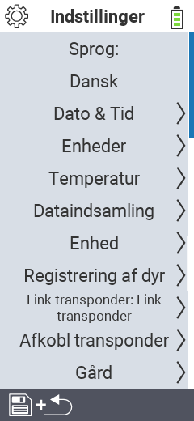

{}
Hvis du klikker på et menupunkt, bliver du omdirigeret til en beskrivelse af den respektive funktion.
{}

<map name="workmap">
  <area shape="rect" coords="2,40,230,120" alt="Sprog" title="Indstil og gem permanent sproget for brugergrænsefladen på din VitalControl-enhed&#10;Museklik: åbn dokumentation" href="/da/docs/settings/language/">
  <area shape="rect" coords="2,120,230,160" alt="Dato & Tid" title="Her indstiller du dato og tid&#10;Museklik: åbn dokumentation" href="/da/docs/settings/datetime/">
  <area shape="rect" coords="2,160,230,200" alt="Enheder" title="Her vælger du enheder for temperatur og masse&#10;Museklik: åbn dokumentation" href="/da/docs/settings/units/">
  <area shape="rect" coords="2,200,230,240" alt="Temperatur" title="Indstil temperaturindstillingerne for anvendelsen af din VitalControl-enhed&#10;Museklik: åbn dokumentation" href="/da/docs/settings/temperature/">
   <area shape="rect" coords="2,240,230,280" alt="Dataindsamling" title="Her gemmer du relevante oplysninger til dyredataindsamling&#10;Museklik: åbn dokumentation" href="/da/docs/settings/data-acquisition/">
   <area shape="rect" coords="2,280,230,320" alt="Enhed" title="Her kan du justere forskellige enhedsindstillinger&#10;Mausklick: zur Dokumentation" href="/da/docs/settings/device/">
   <area shape="rect" coords="2,320,230,360" alt="Registrering af dyr" title="Her kan du justere flere fabriksindstillede standarder vedrørende registrering af nye dyr til kravene på din gård.&#10;Museklik: åbn dokumentation" href="/da/docs/settings/animal-registration/">
   <area shape="rect" coords="2,360,230,400" alt="Link transponder" title="Indstil tildelingen af transponderen på din VitalControl-enhed&#10;Museklik: åbn dokumentation" href="/da/docs/settings/transponder-linkage/">
   <area shape="rect" coords="2,400,230,439" alt="Fjern transponder" title="Angiv, hvordan dyre-ID'et vil blive tildelt, efter transponderen er fjernet&#10;Museklik: åbn dokumentation" href="/da/docs/settings/transponder-linkage/">
   <area shape="rect" coords="2,440,230,480" alt="Gård" title="Gem permanent dit officielle tolvcifrede nationale gård-ID på VitalControl-enheden&#10;Museklik: åbn dokumentation" href="/da/docs/settings/farm-number/">
   <area shape="rect" coords="2,482,123,519" alt="Tilbage" title="Hop tilbage et niveau" href="/da/docs/menu/mainmenu/">
</map>

