
<a class="btn btn-lg btn-primary me-3 mb-4" href="#td-block-2">
  Mehr erfahren <i class="fas fa-arrow-alt-circle-right ms-2"></i>
</a>
<a class="btn btn-lg btn-secondary me-3 mb-4" href="/docs/">
  Dokumentation <i class="fa-solid fa-book ms-2 "></i>
</a>

Management der Tiergesundheit auf höchstem Niveau!




{}

**Reduzieren** Sie die **Zettelwirtschaft**  

**Erhöhen** Sie Ihre **Tiergesundheit**

Haben Sie **alles** im **Blick**   

Mit nur **einem Gerät**     

{}


{}
 

    

    <button type="button" data-bs-target="#carouselLanguageIndicators" data-bs-slide-to="0" class="active" aria-current="true" aria-label="Deutsch"></button>
    <button type="button" data-bs-target="#carouselLanguageIndicators" data-bs-slide-to="1" aria-label="English"></button>
    <button type="button" data-bs-target="#carouselLanguageIndicators" data-bs-slide-to="2" aria-label="Dutch"></button>
    <button type="button" data-bs-target="#carouselLanguageIndicators" data-bs-slide-to="3" aria-label="Finnisch"></button>
    <button type="button" data-bs-target="#carouselLanguageIndicators" data-bs-slide-to="4" aria-label="Französisch"></button>
    <button type="button" data-bs-target="#carouselLanguageIndicators" data-bs-slide-to="5" aria-label="Russisch"></button>
    <button type="button" data-bs-target="#carouselLanguageIndicators" data-bs-slide-to="6" aria-label="Spanisch"></button>
    <button type="button" data-bs-target="#carouselLanguageIndicators" data-bs-slide-to="7" aria-label="Bosnisch"></button>
    <button type="button" data-bs-target="#carouselLanguageIndicators" data-bs-slide-to="8" aria-label="Bulgarisch"></button>
    <button type="button" data-bs-target="#carouselLanguageIndicators" data-bs-slide-to="9" aria-label="Chinesisch"></button>
    <button type="button" data-bs-target="#carouselLanguageIndicators" data-bs-slide-to="10" aria-label="Tschechisch"></button>
    <button type="button" data-bs-target="#carouselLanguageIndicators" data-bs-slide-to="11" aria-label="Norwegisch"></button>
    <button type="button" data-bs-target="#carouselLanguageIndicators" data-bs-slide-to="12" aria-label="Griechisch"></button>
    <button type="button" data-bs-target="#carouselLanguageIndicators" data-bs-slide-to="13" aria-label="Türkisch"></button>
    <button type="button" data-bs-target="#carouselLanguageIndicators" data-bs-slide-to="14" aria-label="Ukrainisch"></button>
    <button type="button" data-bs-target="#carouselLanguageIndicators" data-bs-slide-to="15" aria-label="Estnisch"></button>
    
 

    

      

        <h3>Deutsch</h3>
      

      
    

    

      

        <h3>Niederländisch</h3>
      

      
    

    

      

        <h3>Englisch</h3>
      

      
    

    

      

        <h3>Finnisch</h3>
      

      
    

    

      

        <h3>Französisch</h3>
      

      
    

    

      

        <h3>Russisch</h3>
      

    
    
  
    

      

        <h3>Spanisch</h3>
      

    
    

      

        

          <h3>Bosnisch</h3>
        

      
      

      

        

          <h3>Bulgarisch</h3>
        

      
      

      

        

          <h3>Chinesisch</h3>
        

      
      

      

        

          <h3>Tschechisch</h3>
        

      
      

      

        

          <h3>Norwegisch</h3>
        

      
      

      

        

          <h3>Griechisch</h3>
        

      
      
      
      

        

          <h3>Türkisch</h3>
        

      
      
 
      

        

          <h3>Ukrainisch</h3>
        

      
      
 
      

        

          <h3>Estnisch</h3>
        

      
      
 
  

  <button class="carousel-control-prev" type="button" data-bs-target="#carouselLanguagesAutoplaying" data-bs-slide="prev" style="left: 0px; top: 37px; height: 320px;">
    
    Previous
  </button>
  <button class="carousel-control-next" type="button" data-bs-target="#carouselLanguagesAutoplaying" data-bs-slide="next" style="right: 0px; top: 37px; height: 320px;">
    
    Next
  </button>

{}

{}
 

    

    <button type="button" data-bs-target="#carouselActionsIndicators" data-bs-slide-to="0" class="active" aria-current="true" aria-label="Temperatur"></button>
    <button type="button" data-bs-target="#carouselActionsIndicators" data-bs-slide-to="1" aria-label="Wiegung"></button>
    <button type="button" data-bs-target="#carouselActionsIndicators" data-bs-slide-to="2" aria-label="Bewertung"></button>
    <button type="button" data-bs-target="#carouselActionsIndicators" data-bs-slide-to="3" aria-label="Aktionskette"></button>
    <button type="button" data-bs-target="#carouselActionsIndicators" data-bs-slide-to="4" aria-label="Alarm"></button>
    <button type="button" data-bs-target="#carouselActionsIndicators" data-bs-slide-to="5" aria-label="Beobachtung"></button>
    <button type="button" data-bs-target="#carouselActionsIndicators" data-bs-slide-to="6" aria-label="Tierhistorie"></button>
    <button type="button" data-bs-target="#carouselActionsIndicators" data-bs-slide-to="7" aria-label="Ändern"></button>
    <button type="button" data-bs-target="#carouselActionsIndicators" data-bs-slide-to="8" aria-label="Abmelden"></button>
    <button type="button" data-bs-target="#carouselActionsIndicators" data-bs-slide-to="9" aria-label="Tierverlust"></button>
    <button type="button" data-bs-target="#carouselActionsIndicators" data-bs-slide-to="10" aria-label="Transponder zuordnen"></button>
    <button type="button" data-bs-target="#carouselActionsIndicators" data-bs-slide-to="11" aria-label="Transponder abnehmen"></button>
    <button type="button" data-bs-target="#carouselActionsIndicators" data-bs-slide-to="12" aria-label="Ohrmarkennummer zuordnen"></button>
    <button type="button" data-bs-target="#carouselActionsIndicators" data-bs-slide-to="13" aria-label="Elektronische Ohrmarkennummer zuordnen"></button>
  

    

      

        <h3>Temperatur</h3>
      

      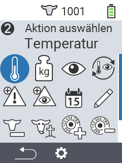
    

    

      

        <h3>Wiegung</h3>
      

      
    

    

      

        <h3>Bewertung</h3>
      

      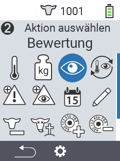
    

    

      

        <h3>Aktionskette</h3>
      

      
    

    

      

        <h3>Alarm</h3>
      

      
    

    

      

        <h3>Beobachtung</h3>
      

      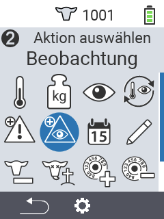
    

    

      

        <h3>Tierhistorie</h3>
      

      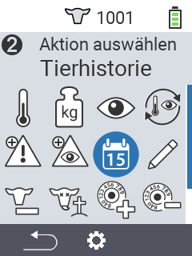
    

    

      

        <h3>Ändern</h3>
      

      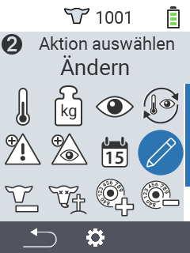
    

    

      

        <h3>Abmelden</h3>
      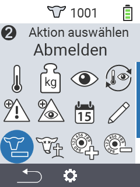
      

    

    

      

        <h3>Tierverlust</h3>
      

      
    

    

      

        <h3 style="font-size: 22px; color: white;">Transponder zuordnen</h3>
      

      
    

    

      

        <h3 style="font-size: 20px; color: white;">Transponder abnehmen</h3>
      

      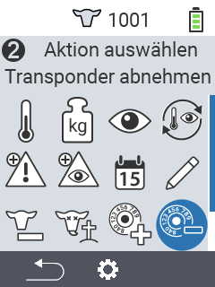
    
      
    

      

        <h4 style="font-size: 20px; color: white;">Ohrmarkennr. zuordnen</h4>
      

      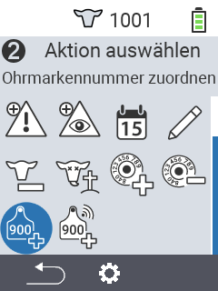
    
   
    

      

        <h5 style="font-size: 20px; color: white;" >Zuordn. elektr. Ohrmarke</h5>
      

      
    
             
  

  <button class="carousel-control-prev" type="button" data-bs-target="#carouselActionsAutoplaying" data-bs-slide="prev" style="left: 0px; top: 37px; height: 320px;">
    
    Previous
  </button>
  <button class="carousel-control-next" type="button" data-bs-target="#carouselActionsAutoplaying" data-bs-slide="next" style="right: 0px; top: 37px; height: 320px;">
    
    Next
  </button>

{}

{}
 

    

    <button type="button" data-bs-target="#carouselListsIndicators" data-bs-slide-to="0" class="active" aria-current="true" aria-label="Alarmliste"></button>
    <button type="button" data-bs-target="#carouselListsIndicators" data-bs-slide-to="1" aria-label="Beobachtungsliste"></button>
    <button type="button" data-bs-target="#carouselListsIndicators" data-bs-slide-to="2" aria-label="Aktionsliste"></button>
    <button type="button" data-bs-target="#carouselListsIndicators" data-bs-slide-to="3" aria-label="Frischmelkerliste"></button>
    <button type="button" data-bs-target="#carouselListsIndicators" data-bs-slide-to="4" aria-label="Trockensteherliste"></button>
  

    

      

        <h3>Alarmliste</h3>
      

      
    

    

      

        <h3>Beobachtungsliste</h3>
      

      
    

    

      

        <h3>Aktionsliste</h3>
      
      
    

    

      

        <h3>Frischmelkerliste</h3>
      

      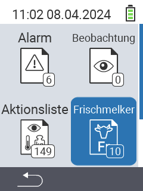
    

    

      

        <h3>Trockensteherliste</h3>
      

    
    

  

  <button class="carousel-control-prev" type="button" data-bs-target="#carouselListsAutoplaying" data-bs-slide="prev" style="left: 0px; top: 37px; height: 320px;">
    
    Previous
  </button>
  <button class="carousel-control-next" type="button" data-bs-target="#carouselListsAutoplaying" data-bs-slide="next" style="right: 0px; top: 37px; height: 320px;">
    
    Next
  </button>

{}

{}
 

    

    <button type="button" data-bs-target="#carouselListsIndicators" data-bs-slide-to="0" class="active" aria-current="true" aria-label="Auswertung Gewicht"></button>
    <button type="button" data-bs-target="#carouselListsIndicators" data-bs-slide-to="1" aria-label="Auswertung Temperatur"></button>
    <button type="button" data-bs-target="#carouselListsIndicators" data-bs-slide-to="2" aria-label="Auswertung Bewertung"></button>
    <button type="button" data-bs-target="#carouselListsIndicators" data-bs-slide-to="3" aria-label="Auswertung Verlustrate"></button>
  

    

      

        <h3>Gewicht</h3>
      
 
      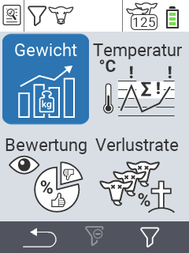
    

    

      

        <h3>Temperatur</h3>
      
 
      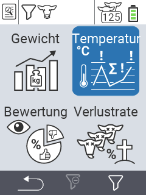
    

    

      

        <h3>Bewertung</h3>
      
 
      
    

    

      

        <h3>Verlustraten</h3>
      
 
      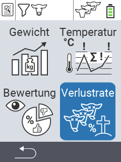
    

  

  <button class="carousel-control-prev" type="button" data-bs-target="#carouselEvaluationAutoplaying" data-bs-slide="prev" style="left: 0px; top: 37px; height: 320px;">
    
    Previous
  </button>
  <button class="carousel-control-next" type="button" data-bs-target="#carouselEvaluationAutoplaying" data-bs-slide="next" style="right: 0px; top: 37px; height: 320px;">
    
    Next
  </button>

{}


{}

Geeignet für **drei** Tiere  

{}


{}
 

 
{}

{}
 

 
{}

{}
 

 
{}



{}

Unsere **Highlights** für Sie

{}


{}
 

 
{}

{}
 

 
{}

{}
 
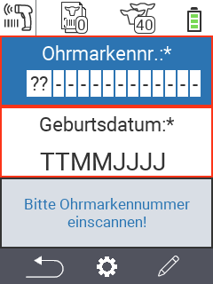
 
{}

{}
 

 
{}



{}

**FAQ´s**

{}



</head>
<body>

<!-- FAQ Abschnitte -->
<button class="accordion">Wie viel kostet das Gerät?</button>

  
Während der Einführungsaktion erhalten Sie das Gerät für 1.099€

<button class="accordion">Für welche Betriebe ist das Gerät geeignet?</button>

  
Das Gerät bietet sowohl für den Fresseraufzüchter als auch für den Milchviehbetrieb passgenaue Lösungen. Alle Anwendungen lassen sich ebenfalls auf Lämmer und Schafe übertragen.

<button class="accordion">Warum sollte ich mir das VitalControl anschaffen?</button>

  
Das VitalControl erleichtert Ihren Arbeitsalltag. Es erspart Ihnen die elendige Zettelwirtschaft und das lange suchen nach Notizen. Alle Daten werden Tierindividuell abgespeichert
  und sind für Sie mit wenigen Klicks abrufbar. Der Überblick über Ihre Tiere und die Kontrolle der Tiergesundheit werden massiv erleichtert. Gleichzeit erhalten Sie diverse
  Auswertungsmöglichkeiten um die Entwicklung wichtiger Kennzahlen optimal im Blick zu haben.

<button class="accordion">Für welche Arbeitsabläufe ist das Gerät geeignet?</button>

  

  <li> Zukäufe von Tieren </li>
   
  Sie scannen die Tierpässe mit dem VitalControl ein und haben so alle Neuankünfte direkt mit der Ohrmarkennummer und dem Geburtsdatum im Gerät hinterlegt. Nun können Sie den Tieren noch einen Transponder zuweisen um das Tierindividuelle Abspeichern der Tierdaten zu ermöglichen. Abschließend exportieren Sie eine CSV-Datei mit der sie die Zukäufe spielend leicht bei HI-Tier oder Herde-Mast melden können.
   
   
   
  <li>Tägliche Tierkontrolle</li>
    
  Das VitalControl bietet Ihnen 14 Aktionen die Sie bei der täglichen Tierkontrolle einsetzen können. Wählen Sie einfach den Menüpunkt "Aktionen" aus, scannen Sie den Transponder des betreffenden Tieres ein und legen Sie los. Messen Sie Fieber, bewerten Sie das Tier oder erfassen Sie das Gewicht während einer Wiegung. 

  

<!-- JavaScript für das Akkordeon -->

</body>
</html>



{}

{}
Urban in den sozialen Netzwerken
{.h1 .text-center}
{}

{}
{}

{}
{}

{}
{}

{}

{}

