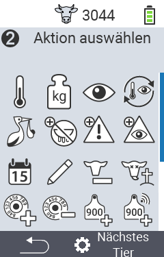

{}
Klicken Sie auf einen Menüpunkt, so werden Sie zu einer Beschreibung der jeweiligen Funktion weitergeleitet.
{}

 

<map name="workmap">
  <area shape="rect" coords="0,100,60,165" alt="Temperatur" title="Messen Sie Fieber bei Ihren Tieren&#10;Mausklick: zur Dokumentation" href="/docs/aktionen/temperatur/">
  <area shape="rect" coords="60,100,118,165" alt="Wiegung" title="Erfassen Sie das Gewicht Ihrer Tiere mittels einer Wiegung&#10;Mausklick: zur Dokumentation" href="/docs/aktionen/wiegung/">
  <area shape="rect" coords="118,100,174,165" alt="Bewertung" title="Führen Sie eine Bewertung ihrer Tiere durch&#10;Mausklick: zur Dokumentation" href="/docs/aktionen/tierbewertung/">
  <area shape="rect" coords="174,100,232,165" alt="Aktionskette" title="Anwenden und Einstellen der Aktionskette&#10;Mausklick: zur Dokumentation" href="/docs/aktionskette/">
   <area shape="rect" coords="0,165,60,225" alt="Abkalbung erfassen" title="Erfassen Sie eine Abkalbung&#10;Mausklick: zur Dokumentation" href="/docs/aktionen/kalbung-erfassen/">
    <area shape="rect" coords="60,165,120,225" alt="Trockenstellen" title="Stellen Sie eine Kuh trocken oder fügen Sie sie zur Frischmelkerliste hinzu&#10;Mausklick: zur Dokumentation" href="/docs/aktionen/trockenstellen/">
   <area shape="rect" coords="120,165,175,225" alt="Alarm" title="Tiere auf die Alarmliste setzen und entfernen&#10;Mausklick: zur Dokumentation" href="/docs/aktionen/alarm/">
   <area shape="rect" coords="175,165,232,225" alt="Beobachtung" title="Setzen Sie ein Tier auf die Beobachtungsliste oder entfernen es von dort&#10;Mausklick: zur Dokumentation" href="/docs/aktionen/beobachtung/">
   <area shape="rect" coords="0,225,60,280" alt="Tierhistorie" title="Sehen Sie die Historie eines Tieres ein&#10;Mausklick: zur Dokumentation" href="/docs/aktionen/tierhistorie/">
   <area shape="rect" coords="60,225,120,280" alt="Tierdaten ändern" title="Wie Sie die Daten des ausgewählten Tieres bearbeiten können&#10;Mausklick: zur Dokumentation" href="/docs/aktionen/ändern/">
   <area shape="rect" coords="120,225,175,280" alt="Abmelden" title="Melden Sie ein Tier ab&#10;Mausklick: zur Dokumentation" href="/docs/aktionen/abmelden/">
   <area shape="rect" coords="175,225,232,280" alt="Tierverlust" title="Registrieren Sie einen Tierverlust&#10;Mausklick: zur Dokumentation" href="/docs/aktionen/tierverlust/">
   <area shape="rect" coords="0,280,60,340" alt="Transponder zuordnen" title="Ordnen Sie einem Tier einen Transponder zu&#10;Mausklick: zur Dokumentation" href="/docs/aktionen/transponder-zuordnen/">
   <area shape="rect" coords="55,280,120,340" alt="Transponder abnehmen" title="Lösen Sie die Transponderverknüpfung zu einem Tier&#10;Mausklick: zur Dokumentation" href="/docs/aktionen/transponder-abnehmen/">
   <area shape="rect" coords="120,280,175,340" alt="Ohrmarkennummer manuell zuordnen" title="Lernen Sie, wie Sie einem Tier, dem noch keine Ohrmarkennummer zugewiesen wurde, eine Ohrmarkennummer zuordnen&#10;Mausklick: zur Dokumentation" href="/docs/aktionen/ohrmarkennummer-zuordnen/#manuelle-zuordnung">
   <area shape="rect" coords="175,280,232,340" alt="Ohrmarkennummer mit Scan zuordnen" title="Lernen Sie, wie Sie einem Tier, dem noch keine Ohrmarkennummer zugewiesen wurde, eine Ohrmarkennummer zuordnen&#10;Mausklick: zur Dokumentation" href="/docs/aktionen/ohrmarkennummer-zuordnen/#zuordnung-mittels-scan-einer-elektronischen-ohrmarke">
</map>
