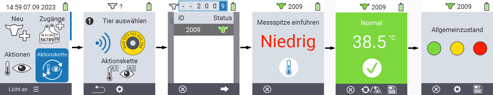
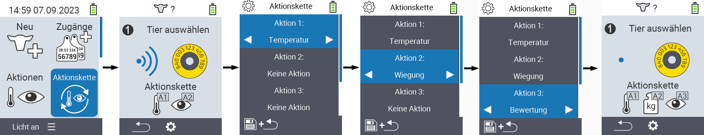

## Aktionskette

Die Aktionskette ermöglicht es Ihnen, mehrere Aktionen für ein Tier automatisch hintereinander durchzuführen. Sie können z.B. die Aktionen `Temperatur messen` und `Bewertung` auswählen. Führen Sie dann die Aktionskette aus, können Sie bei ihrem Tier zunächst das Fieber messen und direkt danach die Bewertung erfassen.

### Aktionskette verwenden

1. Wählen Sie im Hauptbildschirm Ihres VitalControl-Geräts den Menüpunkt `Aktionskette` und drücken Sie die Taste `OK`.

2. Scannen Sie entweder ein Tier mittels des Transponders ein oder bestätigen Sie mit `OK` und verwenden Sie die Pfeiltasten △ ▽ ◁ ▷ um die gewünschte Tier ID einzugeben.

3. Die Aktionskette wird nun ausgeführt. Sobald alle Aktionen der Aktionskette durchgeführt wurden, kann direkt das nächste Tier ausgewählt werden.

    

### Aktionskette einstellen

1. Wählen Sie im Hauptbildschirm Ihres VitalControl-Geräts den Menüpunkt `Aktionskette` und drücken Sie die Taste `OK`.

2. Verwenden Sie die `F2` Taste ⚙ (`Einstellungen`).

3. Es öffnet sich ein Untermenü. Verwenden Sie die Pfeiltasten △ ▽ um zwischen den Aktionsnummern zu wählen. Sie können bis zu vier Aktionen hintereinander ausführen. Verwenden Sie die Pfeiltasten ◁ ▷ um für die jeweilige Aktionsnummer die gewünschte Aktion auszuwählen. Speichern Sie die Einstellungen mit der Taste `F1`.

4. Wenn Sie die gesamte Aktionskette zurücksetzen möchten wählen Sie im Untermenü mit den Pfeiltasten △ ▽ die am Ende der Liste befindliche Option `Reset Aktionskette` und bestätigen Sie mit `OK`.

    

{}
Innerhalb der einzelnen Aktionen haben Sie dieselben Einstellungsmöglichkeiten wie in dem Kapitel [Aktionen](../aktionen) für jede einzelne Aktion beschrieben.
{}

{}
Die Symbole im Startbildschirm der Aktionskette verdeutlichen welche Aktionen Sie in welcher Reihenfolge eingestellt haben.
{}