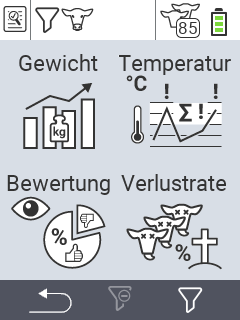

{}
Klicken Sie auf einen Menüpunkt, so werden Sie zu einer Beschreibung der jeweiligen Funktion weitergeleitet.
{}

<map name="workmap">
  <area shape="rect" coords="0,40,116,160" alt="Gewicht" title="Werten Sie die mit dem VitalControl erfassten Gewichtswerte ihrer Tiere aus&#10;Mausklick: zur Dokumentation" href="/docs/auswertung/gewicht/">
  <area shape="rect" coords="0,160,116,280" alt="Bewertung" title="Werten Sie ihre gespeicherten Daten in der Rubrik Bewertung aus&#10;Mausklick: zur Dokumentation" href="/docs/auswertung/beurteilung-tiere/">
 
  <area shape="rect" coords="116,40,232,160" alt="Temperatur" title="Werten Sie ihre gespeicherten Daten in der Rubrik Temperatur aus&#10;Mausklick: zur Dokumentation" href="/docs/auswertung/temperatur/">
  <area shape="rect" coords="116,160,232,280" alt="Verlustrate" title="Werten Sie ihre gespeicherten Daten in der Rubrik Verlustraten aus&#10;Mausklick: zur Dokumentation" href="/docs/auswertung/verlustrate/">
</map>
