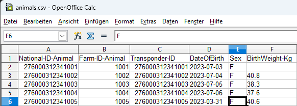

Gehen Sie wie folgt vor, um Daten vom VitalControl auf einen Massenspeicher ihres PCs zu exportieren:

### VitalControl mit dem PC verbinden

1. Verbinden Sie das VitalControl-Gerät via des mitgelieferten USB-Kabels mit ihrem Computer oder Laptop.

   

1. Stellen Sie sicher, dass das VitalControl-Gerät eingeschaltet ist.

### Datenexport durchführen

1. Drücken Sie die Windows-Taste, um das Startmenü zu öffnen

1. *Nur Windows 11*: Klicken Sie auf den Eintrag `Alle Apps`

1. Scrollen Sie in der Liste ihrer installierten Anwendungen nach unten bis zum Buchstaben `U`. Dort sollten Sie einen Eintrag `Urban VitalControl` vorfinden. Klappen Sie ggf. diesen Eintrag auf, damit alle Untermenüeinträge angezeigt werden.

   {}
  Falls Sie in der Liste ihrer Anwendungen den Eintrag `Urban VitalControl` nicht finden können, müssen Sie ggf. die Software `VCSynchronizer` auf ihrem [PC installieren](../vcsynchronizer/installation/).
   {}

1. Klicken Sie jetzt auf den Menüeintrag `Datenexport (CVS)`.

   

1. Der Exportvorgang wird gestartet. Nach dem Ende des Exportvorgangs öffnet sich ein Windows-Explorer Fenster, in dem das Datenverzeichnis angezeigt wird. In dem angezeigten Verzeichnis `data` befinden sich die vier neu erstellten [Exportdateien](../../datenexport/exportdateien/).

   

   {}
  Sie können jede dieser 4 [Exportdateien](../../datenexport/exportdateien/) in einem Tabellenkalkulationsprogramm ihrer Wahl öffnen (wie etwa [Microsoft Excel](https://products.office.com/excel) oder [OpenOffice Calc](https://www.openoffice.org/de/)) und dort eine erweiterte Auswertungen der Daten durchführen. Beispielhaft ist unten die Ansicht der Tabelle `animals.csv` in einem Tabellenkalkulationsprogramm wiedergegeben.

  
   {}
