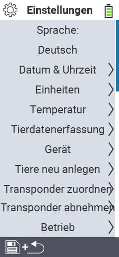

{}
Klicken Sie auf einen Menüpunkt, so werden Sie zu einer Beschreibung der jeweiligen Funktion weitergeleitet.
{}

 

<map name="workmap">
  <area shape="rect" coords="0,40,240,120" alt="Sprache" title="Legen Sie die Sprache für die Benutzerführung auf ihrem VitalControl-Gerät fest&#10;Mausklick: zur Dokumentation" href="/docs/einstellungen/sprache/">
  <area shape="rect" coords="0,120,240,160" alt="Datum & Uhrzeit" title="Hier stellen Sie das Datum und die Uhrzeit für ihr VitalControl-Gerät ein&#10;Mausklick: zur Dokumentation" href="/docs/einstellungen/datum-uhrzeit/">
  <area shape="rect" coords="0,160,240,200" alt="Einheiten" title="Hier wählen Sie Einheiten für die Temperatur und die Masse aus&#10;Mausklick: zur Dokumentation" href="/docs/einstellungen/einheiten/">
  <area shape="rect" coords="0,200,240,240" alt="Temperatur" title="Legen Sie die Temperatureinstellungen für die Anwendung ihres VitalControl Gerät fest&#10;Mausklick: zur Dokumentation" href="/docs/einstellungen/temperatur/">
   <area shape="rect" coords="0,240,240,280" alt="Tierdatenerfassung" title="Hier hinterlegen Sie relevante Informationen für die Tierdatenerfassung&#10;Mausklick: zur Dokumentation" href="/docs/einstellungen/erfassung-tierdaten/">
   <area shape="rect" coords="0,280,240,320" alt="Gerät" title="Hier nehmen Sie verschiedene Geräteeinstellungen vor&#10;Mausklick: zur Dokumentation" href="/docs/einstellungen/geraet/">
   <area shape="rect" coords="0,320,240,360" alt="Tiere neu anlegen" title="Hier passen Sie mehrere werksseitig eingestellte Standards bezüglich des Anlegens von neuen Tieren an die Erfordernisse Ihres Betriebs an&#10;Mausklick: zur Dokumentation" href="/docs/einstellungen/tiere-neu-anlegen/">
   <area shape="rect" coords="0,360,240,400" alt="Transponder zuordnen" title="Legen Sie die Zuordnung des Transponders auf ihrem VitalControl-Gerät fest&#10;Mausklick: zur Dokumentation" href="/docs/einstellungen/zuordnung-transponder/">
   <area shape="rect" coords="0,400,240,440" alt="Betrieb" title="Legen Sie ihre zehnstellige Betriebsnummer gemäß VVO fest&#10;Mausklick: zur Dokumentation" href="/docs/einstellungen/betriebsnummer/">
</map>
