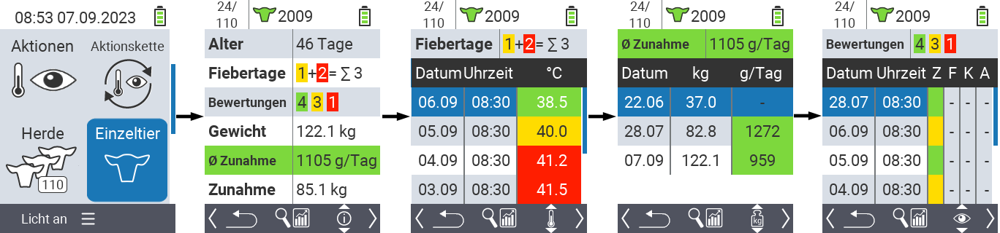
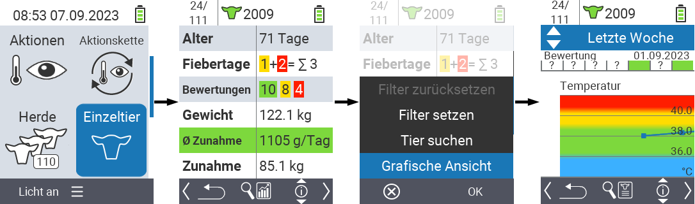
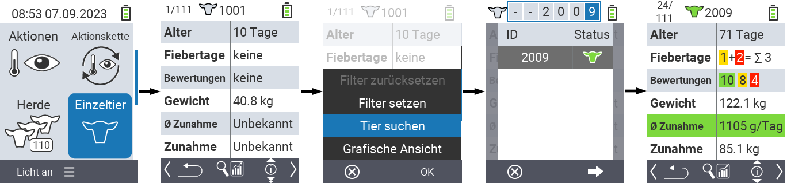
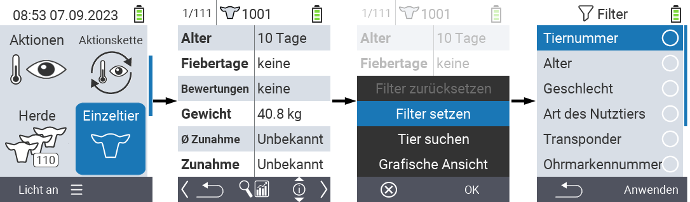

## Einzeltier

Die Funktion Einzeltier ermöglicht es Ihnen wichtige Informationen über Gewicht, Temperatur und Bewertung für jedes individuelle Tier einzusehen. Dabei haben Sie jederzeit die Möglichkeit sich die Informationen als Grafik oder als Liste anzeigen zu lassen. Um die Einzeltierfunktion anzuwenden gehen Sie wie folgt vor:

1. Wählen Sie im Hauptbildschirm Ihres VitalControl-Geräts den Menüpunkt  `Einzeltier` und drücken Sie die Taste `OK`.

2. Es öffnet sich ein Überblick über die wichtigsten Tierinformationen. Im oberen Bildschirmrand wird Ihnen angezeigt welches Tier Sie aktuell einsehen. Verwenden Sie die Taste `F3` um zwischen Tierinformation , Temperatur  , Gewicht  und Bewertung  zu wählen.

 

{}
Innerhalb jeder Informationsanzeige haben Sie die Möglichkeit ein [Tier zu suchen](#tier-suchen), einen [Filter](#filter-setzen) zu setzen und auf eine [grafische Ansicht](#grafische-ansicht-einstellen) umzuschalten.
Außerdem können Sie jederzeit mit den Pfeiltasten ◁ ▷ zwischen den einzelnen Tieren wechseln.
{}

### Grafische Ansicht einstellen

1. Drücken Sie die mittlere, obere `An/Aus` Taste  um ein Popup-Menü zu öffnen. Dort können Sie zwischen den Funktionen `Filter setzen`, `Tier suchen` oder `Grafische Ansicht` wählen.

2. Wählen Sie die Zeile `Grafische Ansicht` mit den Pfeiltasten △ ▽ aus und bestätigen Sie mit `OK`.

 

 ### Tier suchen

 1. Drücken Sie die mittlere, obere `An/Aus` Taste  um ein Popup-Menü zu öffnen. Dort können Sie zwischen den Funktionen `Filter setzen`, `Tier suchen` oder `Grafische Ansicht` wählen.

2. Heben Sie die Zeile `Tier suchen` mit den Pfeiltasten △ ▽ hervor und bestätigen Sie mit `OK`.

3. Verwenden Sie die Pfeiltasten △ ▽ ◁ ▷ um die gewünschte Tiernummer auszuwählen und bestätigen Sie mit `OK`.

 

### Filter setzen

11. Drücken Sie die mittlere, obere `An/Aus` Taste  um ein Popup-Menü zu öffnen. Dort können Sie zwischen den Funktionen `Filter setzen`, `Tier suchen` oder `Grafische Ansicht` wählen.

2. Wählen Sie die Zeile `Filter setzen` mit den Pfeiltasten △ ▽ aus und bestätigen Sie mit `OK`. Wie Sie den Filter anwenden finden Sie [hier](../filter).

 
