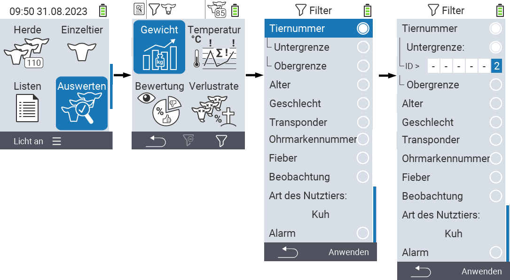
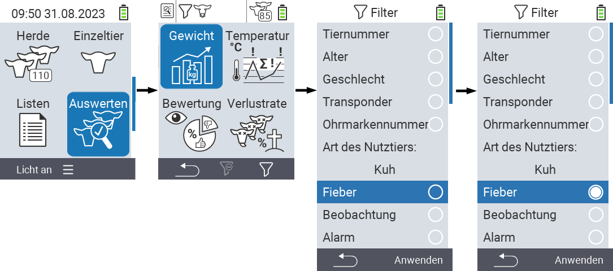

## Tierfilter anwenden
{}
Der Filter hilft Ihnen innerhalb der Menüpunkte `Herde`, `Listen` und `Auswertungen` des VitalControl-Gerätes eine Selektion mittels Filterkriterien durchzuführen. Sobald Sie einen Filter anwenden, erscheinen im oberen Bildschirmrand Symbole für die verschiedenen Filterkriterien. Diese Symbole dienen Ihnen zur Orientierung ob und welche Filterkriterien aktiviert sind. Setzen Sie z.B. den Filter `Geschlecht` auf männlich, verwendet das Gerät nur noch die männlichen Tiere. Aktivieren Sie z. B. zusätzlich den Filter `Beobachtung` verwendet das Gerät nur noch männliche Tiere die auf der Beobachtungsliste stehen.
{}

### Tierfilter anlegen

Um einen Tierfilter für die anzulegen gehen Sie wie folgt vor:

1. Im obersten Menüpunkt  `Auswerten` drücken Sie die `F3` Taste  einmal. In den obersten Menüpunkten  `Listen` und  `Herde` drücken Sie die Taste zweimal.

2. Es öffnet sich ein Untermenü in dem Sie alle Filtermöglichkeiten einstellen können. Sie können nach `Tiernummer`, `Alter`, `Geschlecht`, `Transponder`, `Ohrmarkennummer`, `Fieber`, `Beobachtung`, `Art des Nutztiers` und `Alarm` filtern.

3. Für die Filter `Art des Nutztieres`, `Geschlecht`, `Transponder`und `Ohrmarkennummer` navigieren Sie mit den Pfeiltasten △ ▽ auf das entsprechende Filterkriterium und bestätigen Sie mit `OK`. Verwenden Sie die Pfeiltasten ◁ ▷ um die gewünschte Einstellung festzulegen und drücken sie abschließend `Ok`, um den Editiermodus zu verlassen. Speichern Sie ihre Filtereinstellungen mittels der `F3` Taste `Anwenden` ab, wenn Sie ihre Filtereinstellungen erfolgreich vorgenommen haben. Durch Drücken der `F1` Taste &nbsp;&nbsp; können Sie ihre Änderungen auch verwerfen.

   

4. Für die Filter `Tiernummer` und `Alter` wählen Sie das entsprechende Filterkriterium mit den Pfeiltasten △ ▽ aus und bestätigen Sie mit `OK`. Ihnen wird nun eine Unter- und Obergrenze angezeigt. Navigieren Sie mit den Pfeiltasten △ ▽ auf die gewünschte Grenze und bestätigen Sie zweimal mit `OK`. Nun können Sie mittels der Pfeiltasten ◁ ▷  und Pfeiltasten △ ▽ die gewünschte Zahl einstellen. Nachdem ihre Einstellungen korrekt sind, drücken Sie `OK`, um den Editiermodus zu verlassen. Speichern Sie die ausgewählten Filtereinstellungen mittels der `F3` Taste `Anwenden` ab. Mit der `F1` Taste &nbsp; können Sie ihre getätigten Filtereinstellungen auch verwerfen.

   

5. Für die Filter `Fieber`, `Beobachtung` und `Alarm` besteht die Möglichkeit deren Anwendung zu de- bzw. zu aktivieren. Wählen Sie dafür den entsprechenden Filter mit den Pfeiltasten △ ▽ aus und bestätigen Sie mit `OK`. Der Filter ist nun aktiv. Bestätigen Sie ein weiteres mal mit `OK` um den Filter zu deaktivieren.

   

6. Sobald Sie alle Filter eingestellt haben nutzen Sie die `F3` Taste `Anwenden` um die vereinbarten Filtereinstellungen abzuspeichern. Durch Drücken der `F1` Taste  werden die vereinbarten Filtereinstellungen verworfen.
