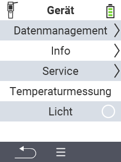

{}
Klicken Sie auf einen Menüpunkt, so werden Sie zu einer Beschreibung der jeweiligen Funktion weitergeleitet.
{}

<map name="workmap">
  <area shape="rect" coords="0,40,240,80" alt="Datenmanagement" title="Führen Sie Datensicherungen aus, exportieren Sie ihre Daten und setzen Sie das Gerät zurück&#10;Mausklick: zur Dokumentation" href="/docs/geraet/datenmanagement/">
  <area shape="rect" coords="0,80,240,120" alt="Info" title="Sehen Sie wichtige Soft- und Hardwareinformationen ein&#10;Mausklick: zur Dokumentation" href="/docs/geraet/info/">
  <area shape="rect" coords="0,120,240,160" alt="Service" title="Prüfen Sie ihre Gerätetreiber, Aktualisieren Sie ihre Firmware und führen Sie einen Reichweitentest durch&#10;Mausklick: zur Dokumentation" href="/docs/geraet/service/">
  <area shape="rect" coords="0,160,240,200" alt="Temperaturmessung" title="Testen Sie die Temperaturmessung Ihres Gerätes&#10;Mausklick: zur Dokumentation" href="/docs/geraet/temperaturmessung/">
   <area shape="rect" coords="0,200,240,240" alt="Licht" title="Schalten Sie das Licht im Kopfteil Ihres VitalControl-Gerät an oder aus&#10;Mausklick: zur Dokumentation" href="/docs/geraet/licht/">
</map>
