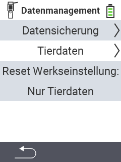

{}
Klicken Sie auf einen Menüpunkt, so werden Sie zu einer Beschreibung der jeweiligen Funktion weitergeleitet.
{}

 

<map name="workmap">
  <area shape="rect" coords="0,40,240,80" alt="Datensicherung erstellen" title="Die Anleitung zu Erstellung einer Datensicherung finden Sie hier&#10;Mausklick: zur Dokumentation" href="/docs/backup/backup/">
  <area shape="rect" coords="0,80,240,120" alt="Datensicherung einspielen" title="Die Anleitung zur Einspielung einer Datensicherung finden Sie hier&#10;Mausklick: zur Dokumentation" href="/docs/backup/restore/">
  <area shape="rect" coords="0,120,240,160" alt="Tierdaten exportieren" title="Alle Informationen und Anleitungen für den Export der Tierdaten finden Sie hier&#10;Mausklick: zur Dokumentation" href="/docs/datenexport/usb-stick/">
  <area shape="rect" coords="0,160,240,240" alt="Reset Werkseinstellung" title="Alle Informationen und Anleitungen für den Reset des Gerätes und der Tierdaten finden Sie hier&#10;Mausklick: zur Dokumentation" href="/docs/reset/">
</map>
