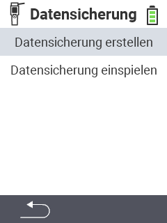

<map name="workmap">
  <area shape="rect" coords="2,40,238,80" alt="Datensicherung erstellen" title="Die Anleitung zu Erstellung einer Datensicherung finden Sie hier&#10;Mausklick: zur Dokumentation" href="/docs/backup/backup/">

  <area shape="rect" coords="2,80,238,120" alt="Datensicherung einspielen" title="Die Anleitung zur Einspielung einer Datensicherung finden Sie hier&#10;Mausklick: zur Dokumentation" href="/docs/backup/restore/">

  <area shape="rect" coords="2,282,125,319" alt="Zurück" title="Springen Sie eine Ebene zurück" href="/docs/geraet/datenmanagement/">

</map>

