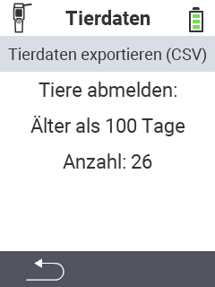

<map name="workmap">
  <area shape="rect" coords="2,40,238,80" alt="Tierdaten exportieren (CSV)" title="Exportieren Sie Ihre Tierdaten&#10;Mausklick: zur Dokumentation" href="/docs/datenexport/usb-stick/">

  <area shape="rect" coords="2,80,238,200" alt="Tiere abmelden: " title="Legen Sie das Mindestalter für die von ihnen manuell abzumeldenden Tiere fest&#10;Mausklick: zur Dokumentation" href="/docs/geraet/datenmanagement/tierdaten/tiere-abmelden/">

  <area shape="rect" coords="2,282,125,319" alt="Zurück" title="Springen Sie eine Ebene zurück" href="/docs/geraet/datenmanagement/">

</map>

