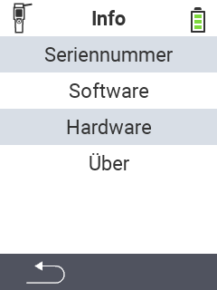

{}
Klicken Sie auf einen Menüpunkt, so werden Sie zu einer Beschreibung der jeweiligen Funktion weitergeleitet.
{}

<map name="workmap">
  <area shape="rect" coords="2,40,238,80" alt="Seriennummer" title="Um die Seriennummer ihres Gerätes abzurufen klicken Sie hier&#10;Mausklick: zur Dokumentation" href="/docs/geraet/info/seriennummer-abrufen/">
  <area shape="rect" coords="2,80,238,120" alt="Software" title="Die Anleitung zur Einsicht ihrer Softwareversion finden Sie hier&#10;Mausklick: zur Dokumentation" href="/docs/firmware/versionen/">
  <area shape="rect" coords="2,120,238,160" alt="Hardware" title="Um die Hardwareinformationen ihres Gerätes abzurufen klicken Sie hier&#10;Mausklick: zur Dokumentation" href="/docs/geraet/info/hardware/">
  <area shape="rect" coords="2,160,238,200" alt="Über" title="Rufen Sie Herstellerinformationen ab&#10;Mausklick: zur Dokumentation" href="/docs/geraet/info/ueber/">

  <area shape="rect" coords="2,282,125,319" alt="Zurück" title="Springen Sie eine Ebene zurück" href="/docs/geraet/">
</map>
