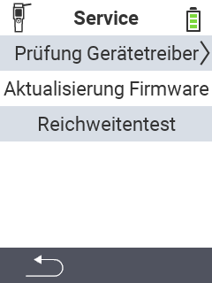

{}
Klicken Sie auf einen Menüpunkt, so werden Sie zu einer Beschreibung der jeweiligen Funktion weitergeleitet.
{}

<map name="workmap">
  <area shape="rect" coords="2,42,238,82" alt="Prüfung Gerätetreiber" title="Die Anleitung zur Prüfung ihrer Gerätetreiber finden Sie hier&#12;Mausklick: zur Dokumentation" href="/docs/diagnose/hardware/">
  <area shape="rect" coords="2,82,238,122" alt="Aktualisierung Firmware" title="Die Anleitung zur Aktualisierung Ihrer Firmware finden Sie hier&#12;Mausklick: zur Dokumentation" href="/docs/firmware/update/">
  <area shape="rect" coords="2,122,238,162" alt="Reichweitentest" title="Die Anleitung zur Durchführung eines Reichweitentests finden Sie hier&#12;Mausklick: zur Dokumentation" href="/docs/diagnose/rfid-scan/">
</map>
