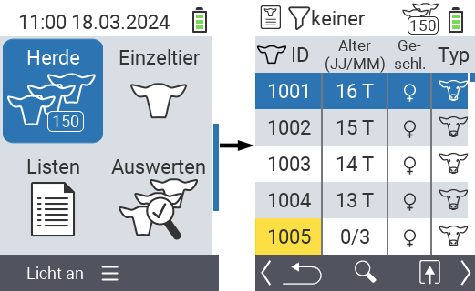
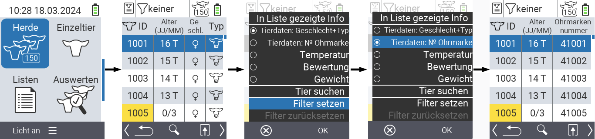
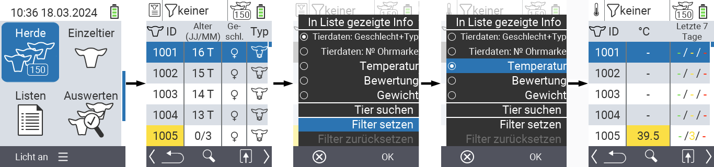
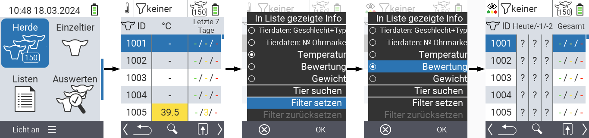
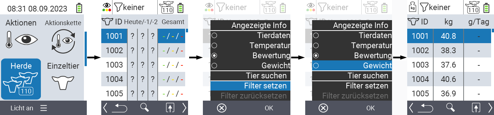
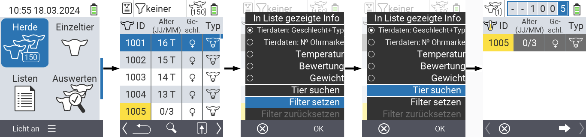
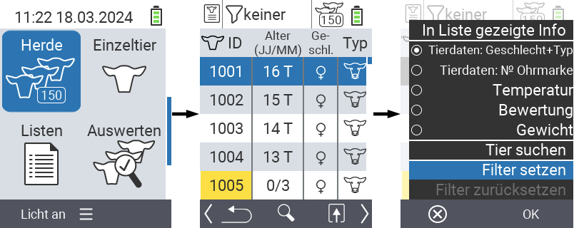
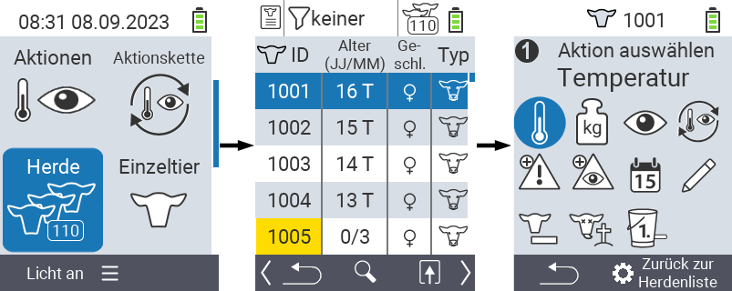

## Herde

Innerhalb des Menüpunktes Herde können Sie Ihre gesamte Herde einsehen, einzelne Tiere suchen und sich wichtige Informationen anzeigen lassen. Sie haben dabei folgende Möglichkeiten:

- [Tierdaten](#tierdaten-anzeigen-lassen) anzeigen lassen
- [Temperaturdaten](#temperatur-anzeigen-lassen) anzeigen lassen
- [Bewertungsdaten](#bewertung-anzeigen-lassen) anzeigen lassen
- [Gewichtsdaten](#gewicht-anzeigen-lassen) anzeigen lassen
- [Tier suchen](#tier-suchen)
- [Filter](../filter/#tierfilter-anwenden) setzen
- [Aktionen](#aktionsmen%C3%BC-aufrufen) aufrufen

### Vorbereitende Schritte

1. Wählen Sie im Hauptbildschirm Ihres VitalControl-Geräts den Menüpunkt  `Herde` und drücken Sie die Taste `OK`.

2. Es öffnet sich die Herdenübersicht.

    

### Tierdaten anzeigen lassen

1. Führen Sie die [vorbereitenden Schritte](#vorbereitende-schritte) durch.

2. Verwenden Sie die `F3` Taste &nbsp;&nbsp; um ein Popup aufzurufen, in dem bestimmen können, welche Tierdaten in der Herdenliste angezeigt werden. Nutzen Sie die Pfeiltasten △ ▽ um die Zeile `Tierdaten: Geschlecht + Typ` oder `Tierdaten: № Ohrmarke` hervorzuheben und wählen sie diese Ansicht durch Drücken der zentralen Taste `OK` oder der `F3` Taste `OK` aus. Die beiden Auswahlmöglichkeiten unterscheiden sich in der Darstellung der Informationsleiste. 

3. In der Herdenliste werden Ihnen nun die allgemeinen Tierdaten und die gewählte Information angezeigt.

4. Alternativ können Sie mit den Pfeiltasten ◁ ▷ zwischen den unterschiedlichen Anzeigemöglichkeiten wechseln.

    

{}
Die Tierdaten werden Ihnen Standardmäßig als erstes angezeigt. Erst wenn Sie sich z.B. das Gewicht anzeigen lassen müssen Sie das Anzeigen der Tierdaten erneut einstellen.
{}

### Temperatur anzeigen lassen

1. Führen Sie die [vorbereitenden Schritte](#vorbereitende-schritte) durch.

2. Verwenden Sie die `F3` Taste &nbsp;&nbsp; um ein Popup aufzurufen, in dem bestimmen können, welche Tierdaten in der Herdenliste angezeigt werden. Nutzen Sie die Pfeiltasten △ ▽ um die Zeile `Temperatur` hervorzuheben und wählen sie diese Ansicht durch Drücken der zentralen Taste `OK` oder der `F3` Taste `OK` aus.

3. In der Herdenliste werden Ihnen nun die Temperaturdaten angezeigt.

4. Alternativ können Sie mit den Pfeiltasten ◁ ▷ zwischen den unterschiedlichen Anzeigemöglichkeiten wechseln.

    

### Bewertung anzeigen lassen

1. Führen Sie die [vorbereitenden Schritte](#vorbereitende-schritte) durch.

2. Verwenden Sie die `F3` Taste &nbsp;&nbsp; um ein Popup aufzurufen, in dem bestimmen können, welche Tierdaten in der Herdenliste angezeigt werden. Nutzen Sie die Pfeiltasten △ ▽ um die Zeile `Bewertung` hervorzuheben und wählen sie diese Ansicht durch Drücken der zentralen Taste `OK` oder der `F3` Taste `OK` aus.

3. In der Herdenliste werden Ihnen nun die Bewertungsdaten angezeigt.

4. Alternativ können Sie mit den Pfeiltasten ◁ ▷ zwischen den unterschiedlichen Anzeigemöglichkeiten wechseln.

    

### Gewicht anzeigen lassen

1. Führen Sie die [vorbereitenden Schritte](#vorbereitende-schritte) durch.

2. Verwenden Sie die `F3` Taste &nbsp;&nbsp; um ein Popup aufzurufen, in dem bestimmen können, welche Tierdaten in der Herdenliste angezeigt werden. Nutzen Sie die Pfeiltasten △ ▽ um die Zeile `Gewicht` hervorzuheben und wählen sie diese Ansicht durch Drücken der zentralen Taste `OK` oder der `F3` Taste `OK` aus.

3. In der Herdenliste werden Ihnen nun die Gewichtsdaten angezeigt.

4. Alternativ können Sie mit den Pfeiltasten ◁ ▷ zwischen den unterschiedlichen Anzeigemöglichkeiten wechseln.

    

### Tier suchen

1. Führen Sie die [vorbereitenden Schritte](#vorbereitende-schritte) durch.

2. Verwenden Sie die `F3` Taste &nbsp;&nbsp; um ein Popup mit verschiedenen Optionen aufzurufen. Nutzen Sie die Pfeiltasten △ ▽ um die Zeile `Tier suchen` hervorzuheben und wählen sie die Suchfunktion durch Drücken der zentralen Taste `OK` oder der `F3` Taste `OK` aus.

3. Verwenden Sie die Pfeiltasten △ ▽ ◁ ▷ um die gewünschte Tiernummer einzugeben und bestätigen Sie mit `OK`.

    

### Filter setzen

1. Führen Sie die [vorbereitenden Schritte](#vorbereitende-schritte) durch.

2. Verwenden Sie die `F3` Taste &nbsp;&nbsp; um ein Popup mit verschiedenen Optionen aufzurufen. Nutzen Sie die Pfeiltasten △ ▽ um die Zeile `Filter setzen` hervorzuheben und wählen sie die Filterfunktion durch Drücken der zentralen Taste `OK` oder der `F3` Taste `OK` aus.

3. Wie Sie den Filter anwenden finden Sie [hier](../filter).

    

### Aktionsmenü aufrufen

Sie haben jederzeit die Möglichkeit das Aktionsmenü für ein Tier aufzurufen.

1. Führen Sie die [vorbereitenden Schritte](#vorbereitende-schritte) durch.

2. Wählen Sie ein Tier aus der Liste mit den Pfeiltasten △ ▽ aus und bestätigen Sie mit `OK`.

3. Das Aktionsmenü ist nun geöffnet. Wie Sie dieses anwenden finden Sie [hier](../aktionen).

4. Kehren Sie durch Drücken der `F1` Taste &nbsp; zurück zum Hauptmenü. Alternativ können Sie mit `F3` zurück zur Herdenliste wechseln um das nächste Tier auszuwählen.

    
