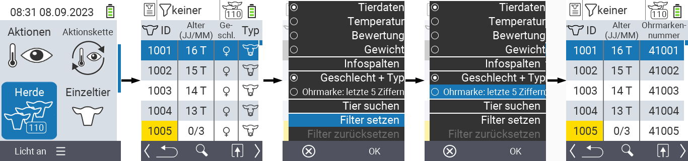

## Herde

Innerhalb des Menüpunktes Herde können Sie Ihre gesamte Herde einsehen, einzelne Tiere suchen und sich wichtige Informationen anzeigen lassen. Sie haben dabei folgende Möglichkeiten:

- [Tierdaten](#tierdaten-anzeigen-lassen) anzeigen lassen
- [Temperaturdaten](#temperatur-anzeigen-lassen) anzeigen lassen
- [Bewertungsdaten](#bewertung-anzeigen-lassen) anzeigen lassen
- [Gewichtsdaten](#gewicht-anzeigen-lassen) anzeigen lassen
- [Tier suchen](#tier-suchen)
- [Filter](../filter/#tierfilter-anwenden) setzen
- [Spalteninformationen](#spalteninformationen-einstellen) einstellen
- [Aktionen](#aktionsmen%C3%BC-aufrufen) aufrufen

### Vorbereitende Schritte

1. Wählen Sie im Hauptbildschirm Ihres VitalControl-Geräts den Menüpunkt  `Herde` und drücken Sie die Taste `OK`.

2. Es öffnet sich die Herdenübersicht.

    

### Tierdaten anzeigen lassen

1. Führen Sie die [vorbereitenden Schritte](#vorbereitende-schritte) durch.

2. Verwenden Sie die  `F3` Taste. Es öffnet sich ein Untermenü in dem Sie verschiedene Einstellungsoptionen haben. Wählen Sie mit den Pfeiltasten △ ▽ `Tierdaten` aus und bestätigen Sie mit `OK`.

3. Es werden Ihnen nun die Tierdaten angezeigt.

4. Alternativ können Sie mit den Pfeiltasten ◁ ▷ zwischen den unterschiedlichen Anzeigemöglichkeiten wechseln.

    

{}
Die Tierdaten werden Ihnen Standardmäßig als erstes angezeigt. Erst wenn Sie sich z.B. das Gewicht anzeigen lassen müssen Sie das Anzeigen der Tierdaten erneut einstellen.
{}

### Temperatur anzeigen lassen

1. Führen Sie die [vorbereitenden Schritte](#vorbereitende-schritte) durch.

2. Verwenden Sie die   `F3` Taste. Es öffnet sich ein Untermenü in dem Sie verschiedene Einstellungsoptionen haben. Wählen Sie mit den Pfeiltasten △ ▽ `Temperatur` aus und bestätigen Sie mit `OK`.

3. Es werden Ihnen nun die Temperaturdaten angezeigt.

4. Alternativ können Sie mit den Pfeiltasten ◁ ▷ zwischen den unterschiedlichen Anzeigemöglichkeiten wechseln.

    

### Bewertung anzeigen lassen

1. Führen Sie die [vorbereitenden Schritte](#vorbereitende-schritte) durch.

2. Verwenden Sie die   `F3` Taste. Es öffnet sich ein Untermenü in dem Sie verschiedene Einstellungsoptionen haben. Wählen Sie mit den Pfeiltasten △ ▽ `Bewertung` aus und bestätigen Sie mit `OK`.

3. Es werden Ihnen nun die Bewertungsdaten angezeigt.

4. Alternativ können Sie mit den Pfeiltasten ◁ ▷ zwischen den unterschiedlichen Anzeigemöglichkeiten wechseln.

    

### Gewicht anzeigen lassen

1. Führen Sie die [vorbereitenden Schritte](#vorbereitende-schritte) durch.

2. Verwenden Sie die   `F3` Taste. Es öffnet sich ein Untermenü in dem Sie verschiedene Einstellungsoptionen haben. Wählen Sie mit den Pfeiltasten △ ▽ `Gewicht` aus und bestätigen Sie mit `OK`.

3. Es werden Ihnen nun die Gewichtsdaten angezeigt.

4. Alternativ können Sie mit den Pfeiltasten ◁ ▷ zwischen den unterschiedlichen Anzeigemöglichkeiten wechseln.

    

### Tier suchen

1. Führen Sie die [vorbereitenden Schritte](#vorbereitende-schritte) durch.

2. Verwenden Sie die   `F3` Taste. Es öffnet sich ein Untermenü in dem Sie verschiedene Einstellungsoptionen haben. Wählen Sie mit den Pfeiltasten △ ▽ `Tier suchen` aus und bestätigen Sie mit `OK`. Alternativ können Sie direkt nach Schritt eins die  `An/Aus` Taste verwenden.

3. Verwenden Sie die Pfeiltasten △ ▽ ◁ ▷ um die gewünschte Tiernummer einzugeben und bestätigen Sie mit `OK`.

    

### Filter setzen

1. Führen Sie die [vorbereitenden Schritte](#vorbereitende-schritte) durch.

2. Verwenden Sie die   `F3` Taste. Es öffnet sich ein Untermenü in dem Sie verschiedene Einstellungsoptionen haben. Wählen Sie mit den Pfeiltasten △ ▽ `Filter setzen` aus und bestätigen Sie mit `OK`.

3. Wie Sie den Filter anwenden finden Sie [hier](../filter).

    

### Spalteninformationen einstellen

{}
Diese Einstellungsmöglichkeit können Sie nur verwenden, wenn Sie sich die `Tierdaten` anzeigen lassen!
{}

1. Führen Sie die [vorbereitenden Schritte](#vorbereitende-schritte) durch.

2. Verwenden Sie die  `F3` Taste. Es öffnet sich ein Untermenü in dem Sie verschiedene Einstellungsoptionen haben. Wählen Sie mit den Pfeiltasten △ ▽ zwischen `Geschlecht & Typ` oder `Ohrmarkennummer` aus und bestätigen Sie mit `OK`.

3. Es wird Ihnen die gewählte Spalteninformation angezeigt.

    

### Aktionsmenü aufrufen

Sie haben jederzeit die Möglichkeit das Aktionsmenü für ein Tier aufzurufen.

1. Führen Sie die [vorbereitenden Schritte](#vorbereitende-schritte) durch.

2. Wählen Sie ein Tier aus der Liste mit den Pfeiltasten △ ▽ aus und bestätigen Sie mit `OK`.

3. Das Aktionsmenü ist nun geöffnet. Wie Sie dieses anwenden finden Sie [hier](../aktionen).

4. Kehren Sie durch Drücken der `F1` Taste &nbsp; zurück zum Hauptmenü. Alternativ können Sie mit `F3` zurück zur Herdenliste wechseln um das nächste Tier auszuwählen.

    
