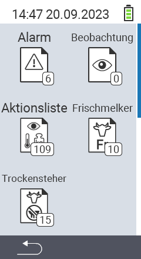

{}
Klicken Sie auf einen Menüpunkt, so werden Sie zu einer Beschreibung der jeweiligen Funktion weitergeleitet.
{}

<map name="workmap">
  <area shape="rect" coords="3,40,116,160" alt="Alarm" title="Sehen Sie ihre Alarmliste ein&#10;Mausklick: zur Dokumentation" href="/docs/listen/alarm/">
  <area shape="rect" coords="3,160,116,280" alt="Aktionsliste" title="Sehen Sie ihre Aktionsliste ein&#10;Mausklick: zur Dokumentation" href="/docs/listen/aktion/">
  <area shape="rect" coords="3,280,116,399" alt="Trockensteherliste" title="Sehen Sie ihre Trockensteherliste ein&#10;Mausklick: zur Dokumentation" href="/docs/listen/trockensteher/">

  <area shape="rect" coords="116,40,230,160" alt="Beobachtungsliste" title="Sehen Sie ihre Beobachtungsliste ein&#10;Mausklick: zur Dokumentation" href="/docs/listen/beobachtung/">
  <area shape="rect" coords="116,160,230,280" alt="Frischmelkerliste" title="Sehen Sie ihre Frischmelkerliste ein&#10;Mausklick: zur Dokumentation" href="/docs/listen/frischmelkerliste/">
</map>
