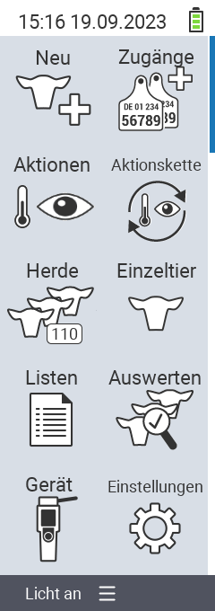

Die nachfolgende interaktive Grafik zeigt den Menübaum des VitalControl-Geräts an:

{}
Klicken Sie auf einen Menüpunkt, so werden Sie zu einer Beschreibung der jeweiligen Funktion weitergeleitet.
{}

<map name="workmap">
  <area shape="rect" coords="3,40,116,160" alt="Neu" title="Neue Tiere anlegen&#10;Mausklick: zur Dokumentation" href="/docs/neu/">
  <area shape="rect" coords="0,160,116,280" alt="Aktionen" title="Aktionen am Tier&#10;Mausklick: zur Dokumentation" href="/docs/aktionen/">
  <area shape="rect" coords="0,280,116,400" alt="Herde" title="Herdenmenü&#10;Mausklick: zur Dokumentation" href="/docs/herde/">
  <area shape="rect" coords="0,400,116,520" alt="Listen" title="Tierlisten&#10;Mausklick: zur Dokumentation" href="/docs/listen/">
  <area shape="rect" coords="0,520,116,640" alt="Gerät" title="Gerät&#10;Mausklick: zur Dokumentation" href="/docs/geraet/">

  <area shape="rect" coords="116,40,232,160" alt="Zugänge" title="Zugänge von Tieren&#10;Mausklick: zur Dokumentation" href="/docs/zugaenge/">
  <area shape="rect" coords="116,160,232,280" alt="Aktionskette" title="Aktionskette&#10;Mausklick: zur Dokumentation" href="/docs/aktionskette/">
  <area shape="rect" coords="116,280,232,400" alt="Einzeltier" title="Einzeltier&#10;Mausklick: zur Dokumentation" href="/docs/einzeltier/">
  <area shape="rect" coords="116,400,232,520" alt="Auswerten" title="Auswerten&#10;Mausklick: zur Dokumentation" href="/docs/auswertung/">
  <area shape="rect" coords="116,520,232,640" alt="Einstellungen" title="Einstellungen&#10;Mausklick: zur Dokumentation" href="/docs/einstellungen/">
</map>
