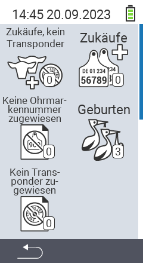

{}
Klicken Sie auf einen Menüpunkt, so werden Sie zu einer Beschreibung der jeweiligen Funktion weitergeleitet.
{}

<map name="workmap">
  <area shape="rect" coords="3,40,116,160" alt="Zukäufe, kein Transponder" title="Hier weisen Sie ihren neu zugekauften Tiere einen Transponder zu&#10;Mausklick: zur Dokumentation" href="/docs/zugaenge/zukaeufe-kein-transponder/">
  <area shape="rect" coords="3,160,116,280" alt="Keine Ohrmarkennummer zugewiesen" title="Hier können Sie alle Tiere einsehen denen noch keine Ohrmarkennummer zugewiesen wurde und diesen Tieren eine Ohrmarkennummer zuweisen&#10;Mausklick: zur Dokumentation" href="/docs/zugaenge/keine-ohrmarkennummer-zugewiesen/">
  <area shape="rect" coords="3,280,116,399" alt="Kein Transponder zugewiesen" title="Hier können Sie alle Tiere einsehen denen noch kein Transponder zugewiesen wurde und diesen ggf. einen Transponder zuweisen.&#10;Mausklick: zur Dokumentation" href="/docs/zugaenge/kein-transponder-zugewiesen/">

  <area shape="rect" coords="116,40,230,160" alt="Zukäufe" title="Hier können Sie ihre aktuellen Zukäufe einsehen und die Daten exportieren&#10;Mausklick: zur Dokumentation" href="/docs/zugaenge/zukaeufe/">
  <area shape="rect" coords="116,160,230,280" alt="Geburten" title="Hier sehen Sie ihre Geburten ein und können ein Datei für die Massenmeldung der Geburten bei HI-Tier erstellen&#10;Mausklick: zur Dokumentation" href="/docs/zugaenge/geburten/">
</map>
