
<a class="btn btn-lg btn-primary me-3 mb-4" href="#td-block-2">
  Μάθετε περισσότερα <i class="fas fa-arrow-alt-circle-right ms-2"></i>
</a>
<a class="btn btn-lg btn-secondary me-3 mb-4" href="docs/">
  Τεκμηρίωση<i class="fa-solid fa-book ms-2 "></i>
</a>

Διαχείριση υγείας στο υψηλότερο επίπεδο!




{}

**Μειώστε** τα **χαρτιά**  

**Αυξήστε** την **υγεία των ζώων σας**

Έχετε **όλα** σε **μια ματιά**   

Με μόλις **μία συσκευή**     
{}


{}
 

    

    <button type="button" data-bs-target="#carouselLanguageIndicators" data-bs-slide-to="0" class="active" aria-current="true" aria-label="German"></button>
    <button type="button" data-bs-target="#carouselLanguageIndicators" data-bs-slide-to="1" aria-label="English"></button>
    <button type="button" data-bs-target="#carouselLanguageIndicators" data-bs-slide-to="2" aria-label="Dutch"></button>
    <button type="button" data-bs-target="#carouselLanguageIndicators" data-bs-slide-to="3" aria-label="Finish"></button>
    <button type="button" data-bs-target="#carouselLanguageIndicators" data-bs-slide-to="4" aria-label="French"></button>
    <button type="button" data-bs-target="#carouselLanguageIndicators" data-bs-slide-to="5" aria-label="Russian"></button>
    <button type="button" data-bs-target="#carouselLanguageIndicators" data-bs-slide-to="6" aria-label="Spanish"></button>
    <button type="button" data-bs-target="#carouselLanguageIndicators" data-bs-slide-to="7" aria-label="Bosnian"></button>
    <button type="button" data-bs-target="#carouselLanguageIndicators" data-bs-slide-to="8" aria-label="Bulgarian"></button>
    <button type="button" data-bs-target="#carouselLanguageIndicators" data-bs-slide-to="9" aria-label="Chinese"></button>
    <button type="button" data-bs-target="#carouselLanguageIndicators" data-bs-slide-to="10" aria-label="Czech"></button>
    <button type="button" data-bs-target="#carouselLanguageIndicators" data-bs-slide-to="11" aria-label="Norwegian"></button>
    <button type="button" data-bs-target="#carouselLanguageIndicators" data-bs-slide-to="12" aria-label="Greek"></button>
    <button type="button" data-bs-target="#carouselLanguageIndicators" data-bs-slide-to="13" aria-label="Turkish"></button>
    <button type="button" data-bs-target="#carouselLanguageIndicators" data-bs-slide-to="14" aria-label="Ukrainian"></button>
    <button type="button" data-bs-target="#carouselLanguageIndicators" data-bs-slide-to="15" aria-label="Estonian"></button>
    
 

    

      

        <h3>German</h3>
      

      
    

    

      

        <h3>Dutch</h3>
      

      
    

    

      

        <h3>English</h3>
      

      
    

    

      

        <h3>Finnish</h3>
      

      
    

    

      

        <h3>French</h3>
      

      
    

    

      

        <h3>Russian</h3>
      

    
    
  
    

      

        <h3>Spanish</h3>
      

    
    

      

        

          <h3>Bosnian</h3>
        

      
      

      

        

          <h3>Bulgarian</h3>
        

      
      

      

        

          <h3>Chinese</h3>
        

      
      

      

        

          <h3>Czech</h3>
        

      
      

      

        

          <h3>Norwegian</h3>
        

      
      

      

        

          <h3>Greek</h3>
        

      
      
      
      

        

          <h3>Turkish</h3>
        

      
      
 
      

        

          <h3>Ukrainian</h3>
        

      
      
 
      

        

          <h3>Estonian</h3>
        

      
      
 
  

  <button class="carousel-control-prev" type="button" data-bs-target="#carouselLanguagesAutoplaying" data-bs-slide="prev" style="left: 0px; top: 37px; height: 320px;">
    
    Previous
  </button>
  <button class="carousel-control-next" type="button" data-bs-target="#carouselLanguagesAutoplaying" data-bs-slide="next" style="right: 0px; top: 37px; height: 320px;">
    
    Next
  </button>

{}

{}
 

    

    <button type="button" data-bs-target="#carouselActionsIndicators" data-bs-slide-to="0" class="active" aria-current="true" aria-label="Θερμοκρασία"></button>
    <button type="button" data-bs-target="#carouselActionsIndicators" data-bs-slide-to="1" aria-label="Ζύγιση"></button>
    <button type="button" data-bs-target="#carouselActionsIndicators" data-bs-slide-to="2" aria-label="Αξιολόγηση"></button>
    <button type="button" data-bs-target="#carouselActionsIndicators" data-bs-slide-to="3" aria-label="Αλυσίδα δράσεων"></button>
    <button type="button" data-bs-target="#carouselActionsIndicators" data-bs-slide-to="4" aria-label="Συναγερμός"></button>
    <button type="button" data-bs-target="#carouselActionsIndicators" data-bs-slide-to="5" aria-label="Σε επιφυλακή"></button>
    <button type="button" data-bs-target="#carouselActionsIndicators" data-bs-slide-to="6" aria-label="Ιστορικό ζώου"></button>
    <button type="button" data-bs-target="#carouselActionsIndicators" data-bs-slide-to="7" aria-label="Επεξεργασία"></button>
    <button type="button" data-bs-target="#carouselActionsIndicators" data-bs-slide-to="8" aria-label="Κατάργηση εγγραφής"></button>
    <button type="button" data-bs-target="#carouselActionsIndicators" data-bs-slide-to="9" aria-label="Απώλεια ζώου"></button>
    <button type="button" data-bs-target="#carouselActionsIndicators" data-bs-slide-to="10" aria-label="Σύνδεση τρανσπόντερ"></button>
    <button type="button" data-bs-target="#carouselActionsIndicators" data-bs-slide-to="11" aria-label="Αποσύνδεση τρανσπόντερ"></button>
    <button type="button" data-bs-target="#carouselActionsIndicators" data-bs-slide-to="12" aria-label="Σύνδεση ταυτότητας ζώου"></button>
    <button type="button" data-bs-target="#carouselActionsIndicators" data-bs-slide-to="13" aria-label="Σύνδεση ηλεκτρονικής ταυτότητας ζώου"></button>
  

    

      

        <h3>Θερμοκρασία</h3>
      

      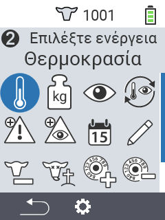
    

    

      

        <h3>Ζύγιση</h3>
      

      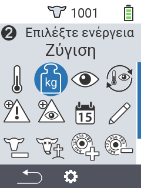
    

    

      

        <h3>Αξιολόγηση</h3>
      

      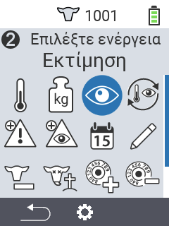
    

    

      

        <h3>Αλυσίδα δράσεων</h3>
      

      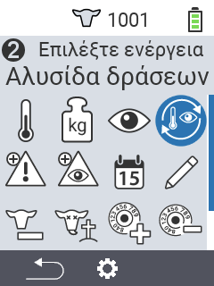
    

    

      

        <h3>Συναγερμός</h3>
      

      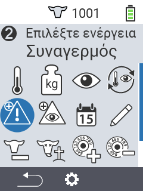
    

    

      

        <h3>Σε επιφυλακή</h3>
      

      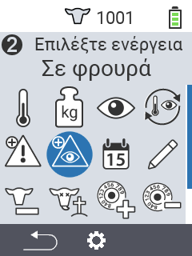
    

    

      

        <h3>Ιστορικό ζώου</h3>
      

      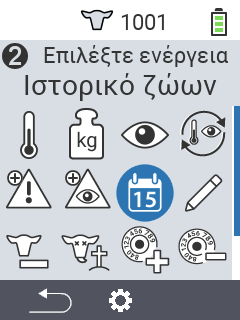
    

    

      

        <h3>Επεξεργασία</h3>
      

      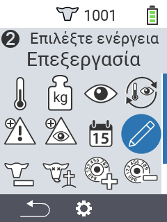
    

    

      

        <h3>Κατάργηση εγγραφής</h3>
      
      

    

    

      

        <h3>Απώλεια ζώου</h3>
      

      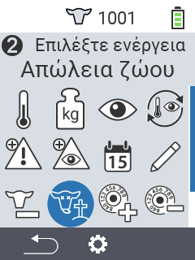
    

    

      

        <h3>Σύνδεση τρανσπόντερ</h3>
      

      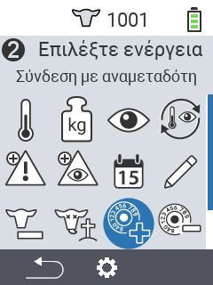
    

    

      

        <h3>Αποσύνδεση τρανσπόντερ</h3>
      

      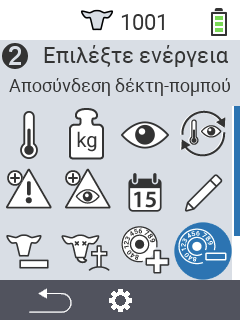
    
      
    

      

        <h3>Σύνδεση ταυτότητας ζώου</h3>
      

      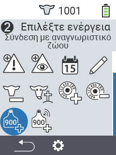
    
   
    

      

        <h3>Σύνδεση ηλεκτρονικής ταυτότητας ζώου</h3>
      

      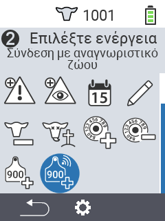
    
             
  

  <button class="carousel-control-prev" type="button" data-bs-target="#carouselActionsAutoplaying" data-bs-slide="prev" style="left: 0px; top: 37px; height: 320px;">
    
    Προηγούμενο
  </button>
  <button class="carousel-control-next" type="button" data-bs-target="#carouselActionsAutoplaying" data-bs-slide="next" style="right: 0px; top: 37px; height: 320px;">
    
    Επόμενο
  </button>

{}

{}
 

    

    <button type="button" data-bs-target="#carouselListsIndicators" data-bs-slide-to="0" class="active" aria-current="true" aria-label="Συναγερμός"></button>
    <button type="button" data-bs-target="#carouselListsIndicators" data-bs-slide-to="1" aria-label="Υπό Παρακολούθηση"></button>
    <button type="button" data-bs-target="#carouselListsIndicators" data-bs-slide-to="2" aria-label="Ενέργεια"></button>
    <button type="button" data-bs-target="#carouselListsIndicators" data-bs-slide-to="3" aria-label="Φρέσκες Αγελάδες"></button>
    <button type="button" data-bs-target="#carouselListsIndicators" data-bs-slide-to="4" aria-label="Ξηρές Αγελάδες"></button>
  

    

      

        <h3>Συναγερμός</h3>
      

      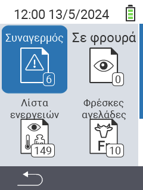
    

    

      

        <h3>Υπό Παρακολούθηση</h3>
      

      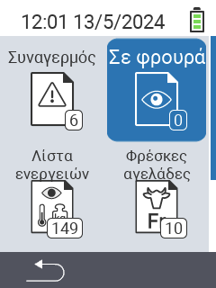
    

    

      

        <h3>Λίστα Ενεργειών</h3>
      
      
      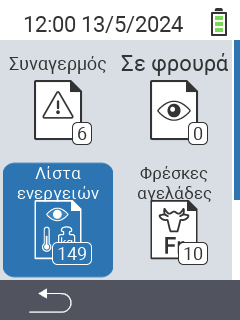
    

    

      

        <h3>Φρέσκες Αγελάδες</h3>
      

      
    

    

      

        <h3>Ξηρές Αγελάδες</h3>
      

    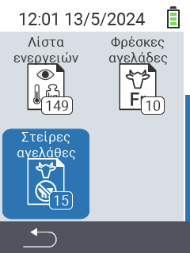
    

  

  <button class="carousel-control-prev" type="button" data-bs-target="#carouselListsAutoplaying" data-bs-slide="prev" style="left: 0px; top: 37px; height: 320px;">
    
    Προηγούμενο
  </button>
  <button class="carousel-control-next" type="button" data-bs-target="#carouselListsAutoplaying" data-bs-slide="next" style="right: 0px; top: 37px; height: 320px;">
    
    Επόμενο
  </button>

{}

{}
 

    

    <button type="button" data-bs-target="#carouselListsIndicators" data-bs-slide-to="0" class="active" aria-current="true" aria-label="Βάρος αξιολόγησης"></button>
    <button type="button" data-bs-target="#carouselListsIndicators" data-bs-slide-to="1" aria-label="Θερμοκρασία αξιολόγησης"></button>
    <button type="button" data-bs-target="#carouselListsIndicators" data-bs-slide-to="2" aria-label="Βαθμολογία αξιολόγησης"></button>
    <button type="button" data-bs-target="#carouselListsIndicators" data-bs-slide-to="3" aria-label="Θνησιμότητα αξιολόγησης"></button>
  

    

      

        <h3>Βάρος</h3>
      
 
      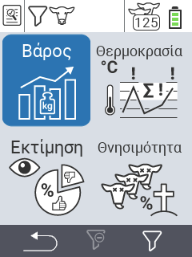
    

    

      

        <h3>Θερμοκρασία</h3>
      
 
      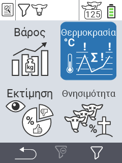
    

    

      

        <h3>Βαθμολογία</h3>
      
 
      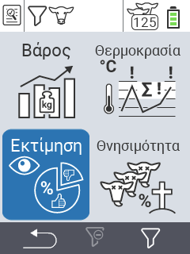
    

    

      

        <h3>Θνησιμότητα</h3>
      
 
      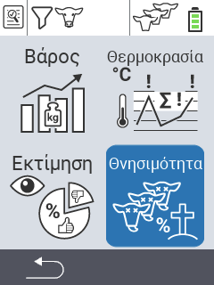
    

  

  <button class="carousel-control-prev" type="button" data-bs-target="#carouselEvaluationAutoplaying" data-bs-slide="prev" style="left: 0px; top: 37px; height: 320px;">
    
    Προηγούμενο
  </button>
  <button class="carousel-control-next" type="button" data-bs-target="#carouselEvaluationAutoplaying" data-bs-slide="next" style="right: 0px; top: 37px; height: 320px;">
    
    Επόμενο
  </button>

{}


{}

Κατάλληλο για διάφορα **είδη ζώων** σε διαφορετικές **ηλικίες**

{}


{}
 

 
{}

{}
 

 
{}

{}
 

 
{}



{}

Τα **σημαντικά** για εσάς

{}


{}
 
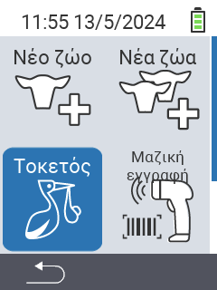
 
{}

{}
 
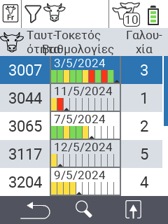
 
{}

{}
 
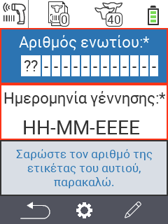
 
{}

{}
 
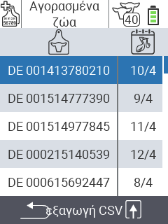
 
{}



{}
Urban στα κοινωνικά δίκτυα

{}

{}

{}
{}

{}
{}

{}
{}

{}
{}


