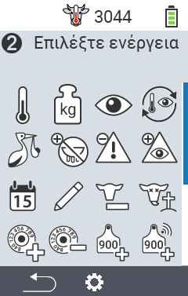
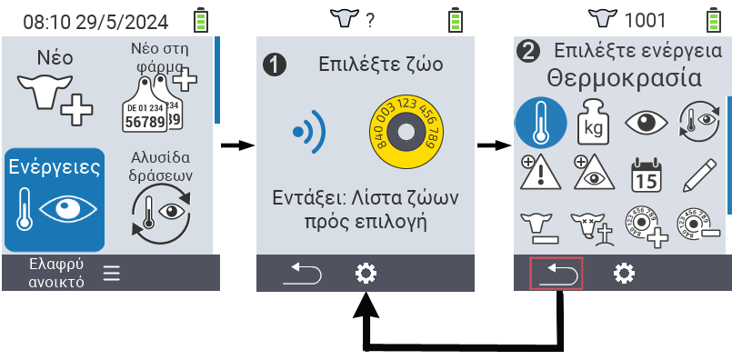
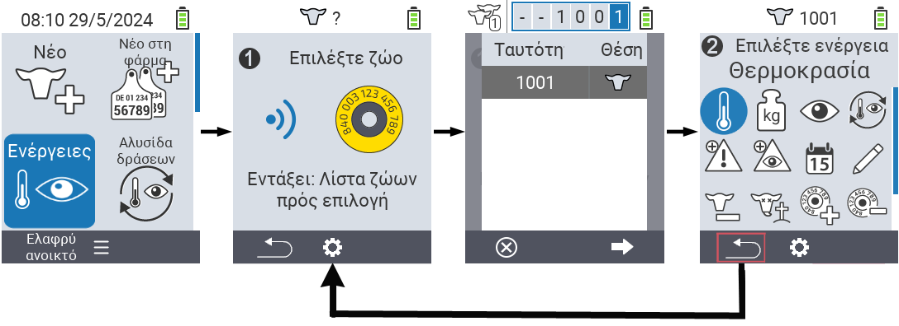

## Διαθέσιμες ενέργειες

Ανάλογα με τον τύπο του ζώου, μπορείτε να εκτελέσετε έως και 16 διαφορετικές ενέργειες για ένα ζώο.

<map name="workmap">
  <area shape="rect" coords="3,100,60,165" alt="Θερμοκρασία" title="Μέτρηση πυρετού στα ζώα σας&#10;Κλικ ποντικιού: άνοιγμα τεκμηρίωσης" href="/el/docs/actions/measure-temperature/">
  <area shape="rect" coords="60,100,118,165" alt="Ζύγιση" title="Καταγραφή του βάρους των ζώων σας&#10;Κλικ ποντικιού: άνοιγμα τεκμηρίωσης" href="/el/docs/actions/record-weight/">
  <area shape="rect" coords="118,100,174,165" alt="Αξιολόγηση" title="Αξιολογήστε τα ζώα σας&#10;Κλικ ποντικιού: άνοιγμα τεκμηρίωσης" href="/el/docs/actions/rating/">
  <area shape="rect" coords="174,100,230,165" alt="Αλυσίδα ενεργειών" title="Εφαρμογή και ρύθμιση της αλυσίδας ενεργειών&#10;Κλικ ποντικιού: άνοιγμα τεκμηρίωσης" href="/el/docs/chain-of-actions/">
   <area shape="rect" coords="3,165,60,225" alt="Τοκετός" title="Καταχώρηση ενός τοκετού&#10;Κλικ ποντικιού: άνοιγμα τεκμηρίωσης" href="/el/docs/actions/calving/">
   <area shape="rect" coords="60,165,120,225" alt="Ξήρανση" title="Ξηράνετε μια αγελάδα ή προσθέστε την στη λίστα των φρέσκων αγελάδων&#10;Κλικ ποντικιού: άνοιγμα τεκμηρίωσης" href="/el/docs/actions/dry-off/">
   <area shape="rect" coords="120,165,175,225" alt="Συναγερμός" title="Προσθήκη και αφαίρεση ζώων από τη λίστα συναγερμού&#10;Κλικ ποντικιού: άνοιγμα τεκμηρίωσης" href="/el/docs/actions/alarm/">
   <area shape="rect" coords="175,165,230,225" alt="Υπό παρακολούθηση" title="Τοποθετήστε ζώα στη λίστα υπό παρακολούθηση ή αφαιρέστε τα&#10;Κλικ ποντικιού: άνοιγμα τεκμηρίωσης" href="/el/docs/actions/on-watch/">
   <area shape="rect" coords="3,225,60,280" alt="Ιστορικό ζώου" title="Προβολή του ιστορικού ενός ζώου&#10;Κλικ ποντικιού: άνοιγμα τεκμηρίωσης" href="/el/docs/actions/animal-history/">
   <area shape="rect" coords="60,225,120,280" alt="Επεξεργασία" title="Επεξεργαστείτε τα δεδομένα του επιλεγμένου ζώου&#10;Κλικ ποντικιού: άνοιγμα τεκμηρίωσης" href="/el/docs/actions/edit/">
   <area shape="rect" coords="120,225,175,280" alt="Καταχώρηση" title="Καταχώρηση ενός ζώου&#10;Κλικ ποντικιού: άνοιγμα τεκμηρίωσης" href="/el/docs/actions/unregister/">
   <area shape="rect" coords="175,225,230,280" alt="Απώλεια ζώου" title="Καταχώρηση απώλειας ζώου&#10;Κλικ ποντικιού: άνοιγμα τεκμηρίωσης" href="/el/docs/actions/animal-loss/">
   <area shape="rect" coords="3,280,60,337" alt="Σύνδεση διαμετακομιστή" title="Ανάθεση διαμετακομιστή σε ένα ζώο&#10;Κλικ ποντικιού: άνοιγμα τεκμηρίωσης" href="/el/docs/actions/link-transponder/">
   <area shape="rect" coords="55,280,120,337" alt="Αποσύνδεση διαμετακομιστή" title="Αφαίρεση της σύνδεσης διαμετακομιστή από ένα ζώο&#10;Κλικ ποντικιού: άνοιγμα τεκμηρίωσης" href="/el/docs/actions/unlink-transponder/">
   <area shape="rect" coords="120,280,175,337" alt="Χειροκίνητη σύνδεση ταυτότητας ζώου" title="Ανάθεση εθνικής ταυτότητας ζώου σε ένα ζώο που δεν έχει εθνική ταυτότητα&#10;Κλικ ποντικιού: άνοιγμα τεκμηρίωσης" href="/el/docs/actions/link-animal-id/#link-animal-id">
   <area shape="rect" coords="175,280,230,337" alt="Σύνδεση ταυτότητας ζώου με σάρωση" title="Ανάθεση εθνικής ταυτότητας ζώου σε ένα ζώο που δεν έχει εθνική ταυτότητα&#10;Κλικ ποντικιού: άνοιγμα τεκμηρίωσης" href="/el/docs/actions/link-animal-id/#link-animal-id-with-electronic-ear-tag-scan">

<area shape="rect" coords="100,340,140,375" alt="Settings" title="Κλήση ρυθμίσεων&#10;Κλικ ποντικιού: στην τεκμηρίωση" href="/el/docs/actions/settings/">
</map>

{}
Κάθε ενέργεια αναγνωρίζεται από ένα σύμβολο. Μετακινήστε τον δείκτη του ποντικιού πάνω από ένα σύμβολο στην παρακάτω γραφική παράσταση και αφήστε τον εκεί για λίγο. Ένα εργαλείο εμφανίζεται, παρουσιάζοντας πληροφορίες για την αντίστοιχη ενέργεια. Αν κάνετε κλικ σε ένα από τα σύμβολα, θα μεταφερθείτε σε μια περιγραφή της αντίστοιχης ενέργειας.
{}

## Γενική διαδικασία

Μέσα στο μενού  `Ενέργειες` μπορείτε να επιλέξετε το επόμενο ζώο ανά πάσα στιγμή χωρίς να χρειάζεται να φύγετε από το στοιχείο μενού Ενέργειες. Για να επιλέξετε το επόμενο ζώο, προχωρήστε ως εξής:

1. Επιλέξτε το στοιχείο μενού  `Ενέργειες` στην κύρια οθόνη της συσκευής σας VitalControl και πατήστε το κουμπί `OK`.

2. Είτε σαρώστε ένα ζώο χρησιμοποιώντας τον ανιχνευτή είτε επιλέξτε ένα ζώο από τη λίστα. Επιβεβαιώστε πατώντας `OK` και επιλέξτε ένα ζώο χρησιμοποιώντας τα κουμπιά βελών △ ▽. Επιβεβαιώστε με `OK`.

3. Ανοίγει ένα υπομενού στο οποίο θα βρείτε εικονίδια για πολλές ενέργειες ζώων. Χρησιμοποιήστε τα κουμπιά βελών για να επιλέξετε την επιθυμητή ενέργεια και ξεκινήστε την ενέργεια πατώντας το κουμπί `OK`. Ανάλογα με την επιλεγμένη ενέργεια, θα εμφανιστεί μία ή περισσότερες οθόνες ή ένα αναδυόμενο παράθυρο.

4. Αν το επιθυμείτε, τώρα μπορείτε να επιλέξετε και να εκτελέσετε μια άλλη ενέργεια για το τρέχον ζώο.

5. Αφού έχετε εκτελέσει τις επιθυμητές ενέργειες για το ζώο, επιστρέψτε στο βήμα 2 'Επιλογή ζώου'. Για να το κάνετε αυτό, πατήστε το κουμπί `F1` στο αριστερό κάτω μέρος του υποσέλιδου κάτω από το σύμβολο `Πίσω`.

6. Το παράθυρο από το βήμα δύο θα ανοίξει αυτόματα ξανά και μπορείτε να επιλέξετε το επόμενο ζώο ή να επιστρέψετε στο κύριο μενού πατώντας το κουμπί `F1` κάτω από το σύμβολο `Πίσω`.



{}

{}
{}

{}


Please paste the Markdown content you want translated into Greek.
