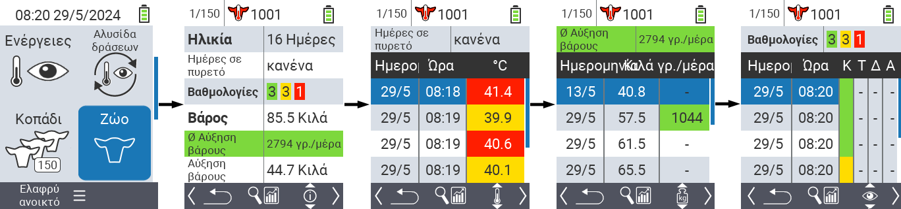
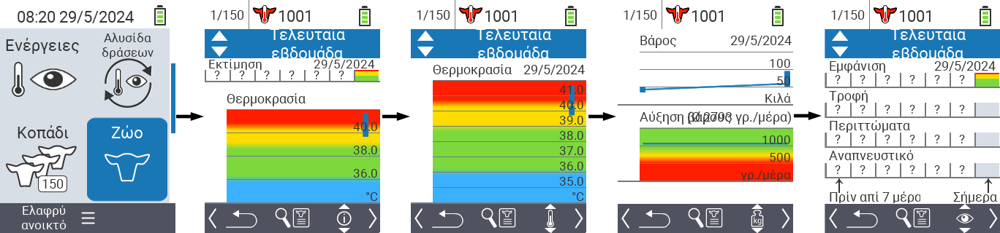
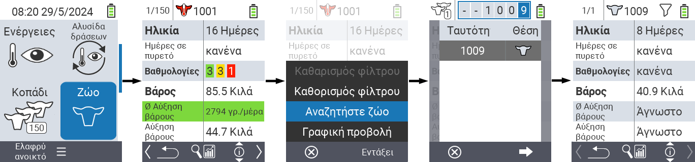
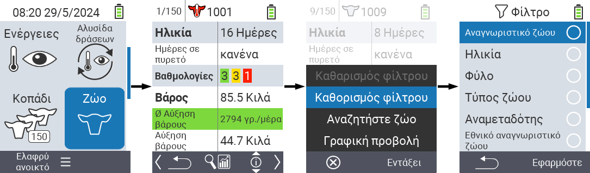

## Ζώο

Η λειτουργία για τα επιμέρους ζώα σας επιτρέπει να δείτε σημαντικές πληροφορίες για το βάρος, τη θερμοκρασία και την αξιολόγηση για κάθε ζώο ξεχωριστά. Έχετε πάντα την επιλογή να εμφανίσετε τις πληροφορίες ως γραφική παράσταση ή ως λίστα. Για να χρησιμοποιήσετε τη λειτουργία για επιμέρους ζώα, προχωρήστε ως εξής:

1. Στην κύρια οθόνη της συσκευής σας VitalControl, επιλέξτε το στοιχείο μενού  `Ζώο` και πατήστε το κουμπί `OK`.

2. Ανοίγει μια επισκόπηση των πιο σημαντικών πληροφοριών του ζώου. Η επάνω άκρη της οθόνης σας δείχνει ποιο ζώο βλέπετε αυτή τη στιγμή. Χρησιμοποιήστε το κλειδί `F3` για να επιλέξετε μεταξύ πληροφοριών ζώου , θερμοκρασίας , βάρους   και αξιολόγησης .

{}
Σε κάθε εμφάνιση πληροφοριών έχετε την επιλογή να [αναζητήσετε ένα ζώο](#search-animal), να ορίσετε ένα [φίλτρο](#set-filter) και να μεταβείτε σε [γραφική προβολή](#set-graphical-view).
Μπορείτε επίσης να μεταβείτε ανά πάσα στιγμή μεταξύ των ζώων χρησιμοποιώντας τα πλήκτρα βέλους ◁ ▷.
{}

### Ορισμός γραφικής προβολής

1. Πατήστε το κεντρικό πάνω κουμπί `On/Off`  για να ανοίξετε ένα αναδυόμενο μενού. Σε αυτό το μενού, μπορείτε να επιλέξετε μεταξύ των λειτουργιών `Ορισμός φίλτρου`, `Αναζήτηση ζώου` ή `Γραφική προβολή`.

2. Επιλέξτε `Γραφική προβολή` με τα πλήκτρα βέλους △ ▽ και επιβεβαιώστε με `OK`.

### Αναζήτηση ζώου

1. Πατήστε το κεντρικό πάνω κουμπί `On/Off`  για να ανοίξετε ένα αναδυόμενο μενού. Σε αυτό το μενού, μπορείτε να επιλέξετε μεταξύ των λειτουργιών `Ορισμός φίλτρου`, `Αναζήτηση ζώου` ή `Γραφική προβολή`.

2. Επιλέξτε `Αναζήτηση ζώου` με τα βελάκια △ ▽ και επιβεβαιώστε με `OK`.

3. Χρησιμοποιήστε τα βελάκια △ ▽ ◁ ▷ για να επιλέξετε τον επιθυμητό αριθμό ζώου και επιβεβαιώστε με `OK`

### Ορισμός φίλτρου

1. Πατήστε το κεντρικό πάνω κουμπί `On/Off`  για να ανοίξετε ένα αναδυόμενο μενού. Σε αυτό το μενού, μπορείτε να επιλέξετε μεταξύ των λειτουργιών `Ορισμός φίλτρου`, `Αναζήτηση ζώου` ή `Γραφική προβολή`.

2. Επιλέξτε `Ορισμός φίλτρου` με τα βελάκια △ ▽ και επιβεβαιώστε με `OK`.
Μπορείτε να λάβετε οδηγίες για το πώς να χρησιμοποιήσετε το φίλτρο [εδώ]().

