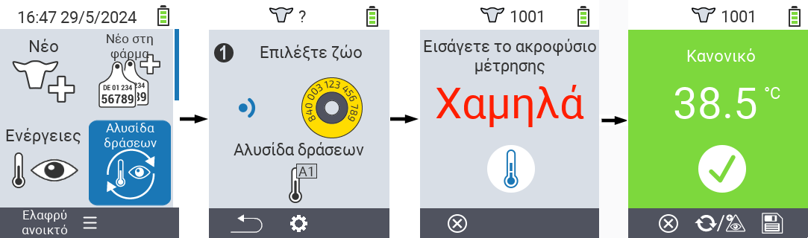
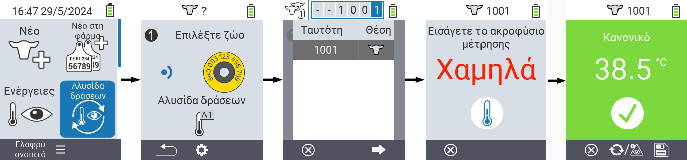
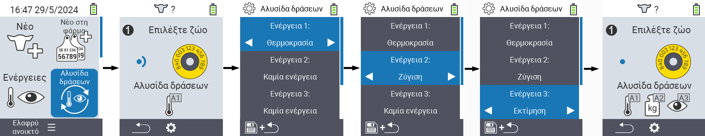

## Αλυσίδα ενεργειών {#chain-of-actions}

Η αλυσίδα ενεργειών σας επιτρέπει να εκτελέσετε αυτόματα πολλές ενέργειες για ένα ζώο, η μία μετά την άλλη. Για παράδειγμα, μπορείτε να επιλέξετε τις ενέργειες `Μέτρηση θερμοκρασίας` και `Αξιολόγηση`. Εάν στη συνέχεια εκτελέσετε την αλυσίδα ενεργειών, μπορείτε πρώτα να πάρετε τη θερμοκρασία του ζώου σας και αμέσως μετά να καταγράψετε την αξιολόγηση.

### Χρήση αλυσίδας ενεργειών {#use-chain-of-actions}

1. Στην κύρια οθόνη της συσκευής σας VitalControl, επιλέξτε το στοιχείο μενού &nbsp;&nbsp; `Αλυσίδα ενεργειών` και πατήστε το κουμπί `OK`.

2. Είτε σαρώστε ένα ζώο χρησιμοποιώντας τον ανιχνευτή ή επιβεβαιώστε με `OK` και χρησιμοποιήστε τα πλήκτρα βέλους △ ▽ ◁ ▷ για να εισάγετε το επιθυμητό αναγνωριστικό του ζώου.

3. Η αλυσίδα ενεργειών τώρα εκτελείται. Μόλις όλες οι ενέργειες στην αλυσίδα ενεργειών έχουν πραγματοποιηθεί, το επόμενο ζώο μπορεί να επιλεγεί απευθείας.



{}

{}
{}

{}


### Ρύθμιση αλυσίδας ενεργειών {#set-chain-of-actions}

1. Στην κύρια οθόνη της συσκευής σας VitalControl, επιλέξτε το στοιχείο μενού &nbsp;&nbsp; `Αλυσίδα Ενεργειών` και πατήστε το κουμπί `OK`.

2. Χρησιμοποιήστε το κουμπί `F2` &nbsp;&nbsp; (`ρυθμίσεις`).

3. Ένας επικαλυπτόμενος οθόνη εμφανίζεται. Χρησιμοποιήστε τα πλήκτρα βέλους △ ▽ για να επιλέξετε ανάμεσα στις ενέργειες 1 - 4 (μπορείτε να εκτελέσετε έως τέσσερις ενέργειες σε σειρά). Χρησιμοποιήστε τα πλήκτρα βέλους ◁ ▷ για να επιλέξετε την επιθυμητή ενέργεια για την αντίστοιχη ενέργεια. Αποθηκεύστε τις ρυθμίσεις με το κλειδί `F1` &nbsp;&nbsp;.

4. Εάν θέλετε να επαναφέρετε ολόκληρη την αλυσίδα ενεργειών, επιλέξτε την επιλογή `Reset chain of actions` στο υπομενού χρησιμοποιώντας τα βελάκια △ ▽ και επιβεβαιώστε με `OK`.

    

{}
Μέσα στις ατομικές ενέργειες έχετε τις ίδιες επιλογές ρύθμισης όπως περιγράφονται στο κεφάλαιο [Actions](../actions) για κάθε ατομική ενέργεια.
{}

{}
Τα σύμβολα στην αρχική οθόνη της αλυσίδας ενεργειών δείχνουν ποιες ενέργειες έχετε ρυθμίσει και σε ποια σειρά.
{}
