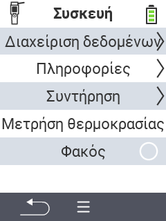

{}
Εάν κάνετε κλικ σε ένα στοιχείο του μενού, θα μεταφερθείτε σε περιγραφή της αντίστοιχης λειτουργίας.
{}

<map name="workmap">
  <area shape="rect" coords="2,40,238,80" alt="Διαχείριση δεδομένων" title="Εκτελέστε αντίγραφα ασφαλείας δεδομένων, εξαγάγετε τα δεδομένα σας και επαναφέρετε τη συσκευή&#10;Κλικ ποντικιού: άνοιγμα τεκμηρίωσης" href="/el/docs/device/data-management/">
  <area shape="rect" coords="2,80,238,120" alt="Πληροφορίες" title="Προβολή σημαντικών πληροφοριών λογισμικού και υλικού&#10;Κλικ ποντικιού: άνοιγμα τεκμηρίωσης" href="/el/docs/device/info/">
  <area shape="rect" coords="2,120,238,160" alt="Υπηρεσία" title="Ελέγξτε τους οδηγούς της συσκευής σας, ενημερώστε το firmware σας και εκτελέστε έναν έλεγχο εμβέλειας&#10;Κλικ ποντικιού: άνοιγμα τεκμηρίωσης" href="/el/docs/device/service/">
  <area shape="rect" coords="2,160,238,200" alt="Μέτρηση θερμοκρασίας" title="Δοκιμάστε τη μέτρηση θερμοκρασίας της συσκευής σας&#10;Κλικ ποντικιού: άνοιγμα τεκμηρίωσης" href="/el/docs/device/temperature-measurement/">
  <area shape="rect" coords="2,200,238,240" alt="Φακός" title="Ενεργοποιήστε ή απενεργοποιήστε το φως στη συσκευή σας VitalControl&#10;Κλικ ποντικιού: άνοιγμα τεκμηρίωσης" href="/el/docs/device/flashlight/">

  <area shape="rect" coords="2,282,97,318" alt="Πίσω" title="Επιστροφή ένα επίπεδο πίσω" href="/el/docs/menu/mainmenu/">
</map>
