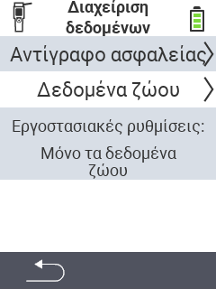

{}
Εάν κάνετε κλικ σε ένα στοιχείο του μενού, θα ανακατευθυνθείτε σε μια περιγραφή της αντίστοιχης λειτουργίας.
{}

<map name="workmap">
  <area shape="rect" coords="2,40,238,80" alt="Αντίγραφο ασφαλείας δεδομένων" title="Οι οδηγίες για τη δημιουργία αντιγράφου ασφαλείας βρίσκονται εδώ&#10;Κλικ ποντικιού: άνοιγμα τεκμηρίωσης" href="/el/docs/device/data-management/data-backup/">

  <area shape="rect" coords="2,80,238,120" alt="Δεδομένα ζώων" title="Οι οδηγίες για την επαναφορά αντιγράφου ασφαλείας βρίσκονται εδώ&#10;Κλικ ποντικιού: άνοιγμα τεκμηρίωσης" href="/el/docs/device/data-management/animal-data/">

  <area shape="rect" coords="2,120,238,200" alt="Επαναφορά εργοστασιακών ρυθμίσεων" title="Όλες οι πληροφορίες και οι οδηγίες για την επαναφορά της συσκευής και των δεδομένων των ζώων βρίσκονται εδώ&#10;Κλικ ποντικιού: άνοιγμα τεκμηρίωσης" href="/el/docs/reset/">

  <area shape="rect" coords="2,282,120,319" alt="Πίσω" title="Όλες οι πληροφορίες και οι οδηγίες για την εξαγωγή δεδομένων ζώων βρίσκονται εδώ&#10;Κλικ ποντικιού: άνοιγμα τεκμηρίωσης" href="/el/docs/device/">
</map>
