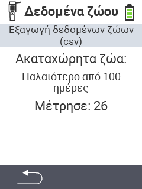

<map name="workmap">
  <area shape="rect" coords="2,40,238,80" alt="Εξαγωγή δεδομένων ζώων (csv)" title="Εξαγωγή των δεδομένων των ζώων σας&#10;Κλικ ποντικιού: άνοιγμα τεκμηρίωσης" href="/el/docs/data-export/usb-drive/">

  <area shape="rect" coords="2,80,238,200" alt="Κατάργηση εγγραφής ζώων" title="Καθορίστε την ηλικία από την οποία τα ζώα πρέπει να διαγραφούν&#10;Κλικ ποντικιού: άνοιγμα τεκμηρίωσης" href="/el/docs/device/data-management/animal-data/unregister-animal/">

  <area shape="rect" coords="2,282,120,319" alt="Πίσω" title="Όλες οι πληροφορίες και οι οδηγίες για την εξαγωγή δεδομένων ζώων βρίσκονται εδώ&#10;Κλικ ποντικιού: άνοιγμα τεκμηρίωσης" href="/el/docs/device/data-management/">
</map>
