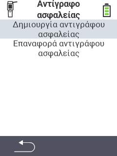

<map name="workmap">
  <area shape="rect" coords="2,40,238,80" alt="Δημιουργία αντιγράφου ασφαλείας" title="Οι οδηγίες για τη δημιουργία αντιγράφου ασφαλείας βρίσκονται εδώ&#10;Κλικ ποντικιού: άνοιγμα τεκμηρίωσης" href="/el/docs/backup/backup/">

  <area shape="rect" coords="2,80,238,120" alt="Επαναφορά αντιγράφου ασφαλείας" title="Οι οδηγίες για την επαναφορά αντιγράφου ασφαλείας βρίσκονται εδώ&#10;Κλικ ποντικιού: άνοιγμα τεκμηρίωσης" href="/el/docs/backup/restore/">

  <area shape="rect" coords="2,282,120,319" alt="Πίσω" title="Επιστροφή ένα επίπεδο πίσω&#10;Κλικ ποντικιού: άνοιγμα τεκμηρίωσης" href="/el/docs/device/data-management/">
</map>
