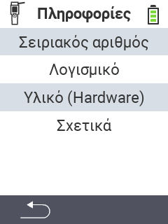

{}
Εάν κάνετε κλικ σε ένα στοιχείο του μενού, θα ανακατευθυνθείτε σε μια περιγραφή της αντίστοιχης λειτουργίας.
{}

<map name="workmap">
  <area shape="rect" coords="2,40,238,80" alt="Σειριακός αριθμός" title="Για να ανακτήσετε τον σειριακό αριθμό της συσκευής σας κάντε κλικ εδώ&#10;Κλικ με το ποντίκι: για τεκμηρίωση" href="/el/docs/device/info/serial-number/">
  <area shape="rect" coords="2,80,238,120" alt="Λογισμικό" title="Οι οδηγίες για την προβολή της έκδοσης του λογισμικού σας βρίσκονται εδώ&#10;Κλικ με το ποντίκι: για τεκμηρίωση" href="/el/docs/firmware/versions/">
  <area shape="rect" coords="2,120,238,160" alt="Υλικό" title="Για πρόσβαση στις πληροφορίες υλικού της συσκευής σας κάντε κλικ εδώ&#10;Κλικ με το ποντίκι: για τεκμηρίωση" href="/el/docs/device/info/hardware/">
  <area shape="rect" coords="2,160,238,200" alt="Σχετικά" title="Κλήση πληροφοριών προμηθευτή&#10;Κλικ με το ποντίκι: για τεκμηρίωση" href="/el/docs/device/info/about/">

  <area shape="rect" coords="2,282,120,319" alt="Πίσω" title="Πηδήστε πίσω ένα επίπεδο&#10;Κλικ με το ποντίκι: ανοίξτε τεκμηρίωση" href="/el/docs/device/">
</map>
