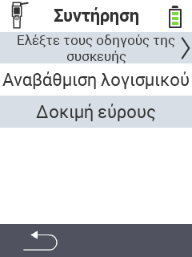

{}
Αν κάνετε κλικ σε ένα στοιχείο του μενού, θα μεταφερθείτε σε μια περιγραφή της αντίστοιχης λειτουργίας.
{}

<map name="workmap">
  <area shape="rect" coords="2,42,238,82" alt="Έλεγχος οδηγών συσκευής" title="Οι οδηγίες για τον έλεγχο των οδηγών της συσκευής σας βρίσκονται εδώ&#10;Κλικ ποντικιού: άνοιγμα τεκμηρίωσης" href="/el/docs/diagnosis/hardware/">
  <area shape="rect" coords="2,82,238,122" alt="Ενημέρωση firmware" title="Οι οδηγίες για την ενημέρωση του firmware βρίσκονται εδώ&#10;Κλικ ποντικιού: άνοιγμα τεκμηρίωσης" href="/el/docs/firmware/update/">
  <area shape="rect" coords="2,122,238,162" alt="Δοκιμή εμβέλειας" title="Οι οδηγίες για τη διεξαγωγή δοκιμής εμβέλειας βρίσκονται εδώ&#10;Κλικ ποντικιού: άνοιγμα τεκμηρίωσης" href="/el/docs/diagnosis/rfid-scan/">

  <area shape="rect" coords="2,282,120,319" alt="Πίσω" title="Πήδημα πίσω επίπεδο&#10;Κλικ ποντικιού: άνοιγμα τεκμηρίωσης" href="/el/docs/device/">
</map>
