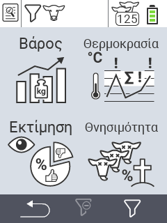

{}
Εάν κάνετε κλικ σε ένα στοιχείο του μενού, θα ανακατευθυνθείτε σε μια περιγραφή της αντίστοιχης λειτουργίας.
{}

<map name="workmap">
  <area shape="rect" coords="3,40,116,160" alt="Βάρος" title="Αξιολογήστε τα αποθηκευμένα σας δεδομένα στην ενότητα Βάρους&#10;Κλικ με το ποντίκι: άνοιγμα τεκμηρίωσης" href="/el/docs/evaluation/weight/">
  <area shape="rect" coords="3,160,116,279" alt="Αξιολόγηση" title="Αξιολογήστε τα αποθηκευμένα σας δεδομένα στην ενότητα αξιολόγησης&#10;Κλικ με το ποντίκι: άνοιγμα τεκμηρίωσης" href="/el/docs/evaluation/rating/">

  <area shape="rect" coords="116,40,238,160" alt="Θερμοκρασία" title="Αξιολογήστε τα αποθηκευμένα σας δεδομένα στην ενότητα Θερμοκρασίας&#10;Κλικ με το ποντίκι: άνοιγμα τεκμηρίωσης" href="/el/docs/evaluation/temperature/">
  <area shape="rect" coords="116,160,238,279" alt="Θνησιμότητα" title="Αξιολογήστε τα αποθηκευμένα σας δεδομένα στην ενότητα θνησιμότητας&#10;Κλικ με το ποντίκι: άνοιγμα τεκμηρίωσης" href="/el/docs/evaluation/mortality/">

  <area shape="rect" coords="150,282,238,319" alt="Φίλτρο" title="Ορίστε ένα φίλτρο&#10;Κλικ με το ποντίκι: στην τεκμηρίωση" href="/el/docs/filter">
  <area shape="rect" coords="2,282,95,319" alt="Πίσω" title="Πηδήστε πίσω ένα επίπεδο&#10;Κλικ με το ποντίκι: στην τεκμηρίωση" href="/el/docs/menu/mainmenu/">
</map>
