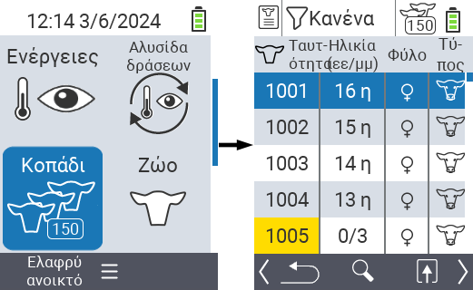
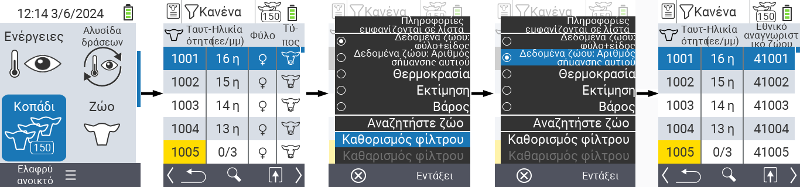
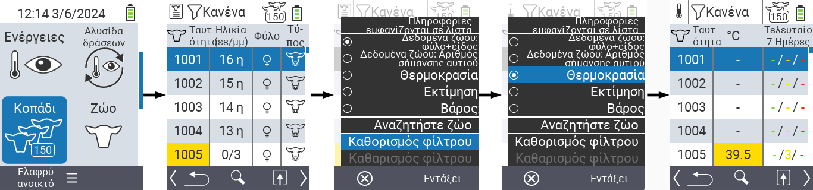
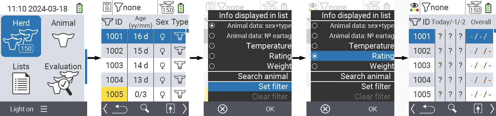
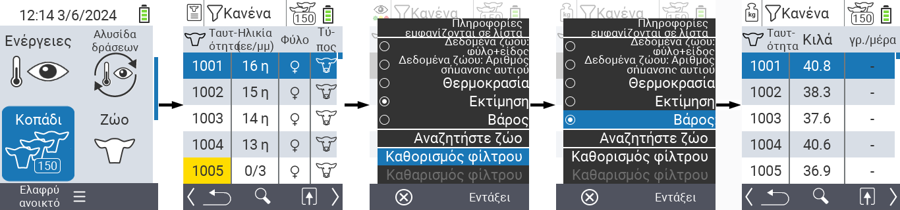
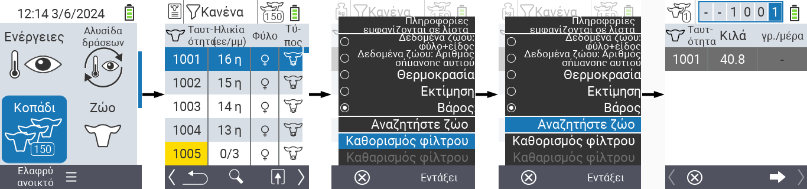
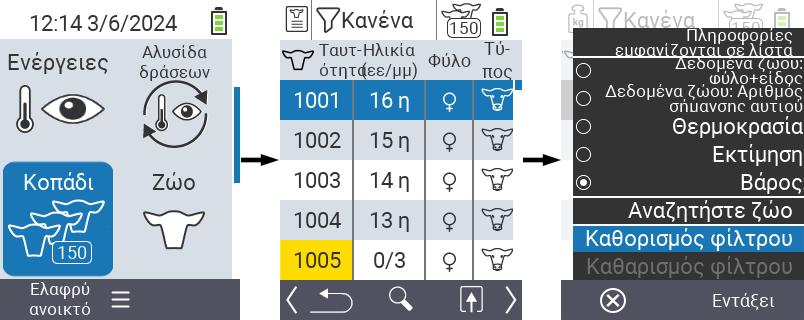
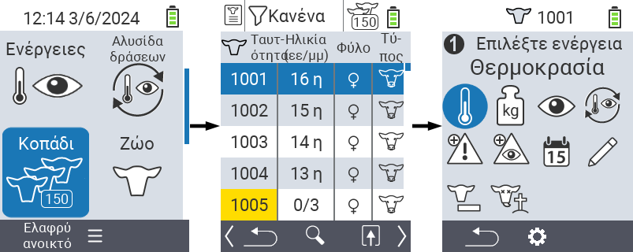

## Κοπάδι {#herd}

Μέσα στο στοιχείο μενού Κοπάδι, μπορείτε να δείτε ολόκληρο το κοπάδι σας, να αναζητήσετε μεμονωμένα ζώα και να εμφανίσετε σημαντικές πληροφορίες. Έχετε τις ακόλουθες δυνατότητες:

- Δείτε [δεδομένα ζώων](#view-animal-data)
- Δείτε [δεδομένα θερμοκρασίας](#display-temperature)
- Δείτε [δεδομένα βαθμολογίας](#view-rating)
- Δείτε [δεδομένα βάρους](#display-weight)
- [Αναζήτηση ζώου](#search-animal)
- Ρύθμιση [φίλτρου](#set-filter)
- [Ενέργειες](#call-action-menu)

### Προπαρασκευαστικά βήματα {#preparatory-steps}

1. Στην κύρια οθόνη της συσκευής σας VitalControl, επιλέξτε το στοιχείο μενού  `Κοπάδι` και πατήστε το κουμπί `OK`.

2. Ανοίγει η επισκόπηση του κοπαδιού σας.

    

### Δείτε δεδομένα ζώων {#view-animal-data}

1. Ολοκληρώστε τα προπαρασκευαστικά βήματα.

2. Χρησιμοποιήστε το κλειδί `F3` &nbsp;&nbsp; για να καλέσετε ένα αναδυόμενο μενού που απαριθμεί τις κατηγορίες πληροφοριών που μπορούν να εμφανιστούν για τη λίστα του κοπαδιού. Χρησιμοποιήστε τα βελάκια △ ▽ για να επισημάνετε τη γραμμή `Δεδομένα ζώων: φύλο + τύπος` ή `Δεδομένα ζώων: N0 σήμανση αυτιού` και επιλέξτε αυτή την κατηγορία πατώντας το κεντρικό κουμπί `OK` ή το κλειδί `F3` `OK`. Οι δύο επιλογές διαφοροποίησης διαφέρουν στην εμφάνιση της γραμμής πληροφοριών.

3. Τα δεδομένα των ζώων θα εμφανιστούν τώρα ως περιεχόμενο της λίστας του κοπαδιού.

4. Εναλλακτικά, μπορείτε να χρησιμοποιήσετε τα βελάκια ◁ ▷ για να μεταβείτε μεταξύ των διαφορετικών επιλογών εμφάνισης.

    

{}
Από προεπιλογή, τα δεδομένα των ζώων εμφανίζονται πρώτα. Μόνο όταν έχετε τα δεδομένα βάρους εμφανισμένα, για παράδειγμα, πρέπει να ρυθμίσετε ξανά την εμφάνιση των δεδομένων των ζώων.
{}

### Εμφάνιση θερμοκρασίας {#display-temperature}

1. Ολοκληρώστε τα προπαρασκευαστικά βήματα.

2. Χρησιμοποιήστε το πλήκτρο `F3` &nbsp;&nbsp; για να ενεργοποιήσετε ένα αναδυόμενο μενού που εμφανίζει τις κατηγορίες πληροφοριών που μπορούν να εμφανιστούν για τη λίστα του κοπαδιού. Χρησιμοποιήστε τα βελάκια △ ▽ για να επιλέξετε τη γραμμή `Temperature` και επιλέξτε αυτή την κατηγορία πατώντας το κεντρικό πλήκτρο `OK` ή το πλήκτρο `F3` `OK`.

3. Τα δεδομένα θερμοκρασίας θα εμφανιστούν τώρα ως περιεχόμενο της λίστας του κοπαδιού.

4. Εναλλακτικά, μπορείτε να χρησιμοποιήσετε τα βελάκια ◁ ▷ για να μεταβείτε μεταξύ των διαφορετικών επιλογών εμφάνισης.

    

### Προβολή βαθμολογίας {#view-rating}

1. Ολοκληρώστε τα προπαρασκευαστικά βήματα.

2. Χρησιμοποιήστε το πλήκτρο `F3` &nbsp;&nbsp; για να ενεργοποιήσετε ένα αναδυόμενο μενού που εμφανίζει τις κατηγορίες πληροφοριών που μπορούν να εμφανιστούν για τη λίστα του κοπαδιού. Χρησιμοποιήστε τα βελάκια △ ▽ για να επιλέξετε τη γραμμή `Rating` και επιλέξτε αυτή την κατηγορία πατώντας το κεντρικό πλήκτρο `OK` ή το πλήκτρο `F3` `OK`.

3. Τα δεδομένα βαθμολογίας θα εμφανιστούν τώρα ως περιεχόμενο της λίστας του κοπαδιού.

4. Εναλλακτικά, μπορείτε να χρησιμοποιήσετε τα βελάκια ◁ ▷ για να μεταβείτε μεταξύ των διαφορετικών επιλογών εμφάνισης.

    

### Εμφάνιση βάρους {#display-weight}

1. Ολοκληρώστε τα προπαρασκευαστικά βήματα.

2. Χρησιμοποιήστε το πλήκτρο `F3` &nbsp;&nbsp; για να ενεργοποιήσετε ένα αναδυόμενο μενού που εμφανίζει τις κατηγορίες πληροφοριών που μπορούν να εμφανιστούν για τη λίστα του κοπαδιού. Χρησιμοποιήστε τα βελάκια △ ▽ για να επιλέξετε τη γραμμή `Weight` και επιλέξτε αυτή την κατηγορία πατώντας το κεντρικό πλήκτρο `OK` ή το πλήκτρο `F3` `OK`.

3. Τα δεδομένα βάρους θα εμφανιστούν τώρα ως περιεχόμενο της λίστας του κοπαδιού.

4. Εναλλακτικά, μπορείτε να χρησιμοποιήσετε τα βελάκια ◁ ▷ για να μεταβείτε μεταξύ των διαφορετικών επιλογών εμφάνισης.

    

### Αναζήτηση ζώου {#search-animal}

1. Ολοκληρώστε τα προπαρασκευαστικά βήματα.

2. Χρησιμοποιήστε το πλήκτρο `F3` &nbsp;&nbsp; για να ενεργοποιήσετε ένα αναδυόμενο μενού που εμφανίζει διάφορες επιλογές. Χρησιμοποιήστε τα βελάκια △ ▽ για να επιλέξετε τη λειτουργία `Search animal` και ενεργοποιήστε τη λειτουργία αναζήτησης πατώντας το κεντρικό πλήκτρο `OK` ή το πλήκτρο `F3` `OK`. Εναλλακτικά, μπορείτε να χρησιμοποιήσετε το πλήκτρο `On/Off`  αμέσως μετά το πρώτο βήμα.

3. Χρησιμοποιήστε τα βελάκια △ ▽ ◁ ▷ για να εισάγετε τον αριθμό του επιθυμητού ζώου και επιβεβαιώστε με `OK`.

    

### Ορισμός φίλτρου {#set-filter}

1. Ολοκληρώστε τα προπαρασκευαστικά βήματα.

2. Χρησιμοποιήστε το πλήκτρο `F3` &nbsp;&nbsp; για να καλέσετε ένα αναδυόμενο μενού που περιλαμβάνει διάφορες επιλογές. Χρησιμοποιήστε τα βελάκια △ ▽ για να επιλέξετε τη λειτουργία `Ορισμός φίλτρου` και ενεργοποιήστε τη λειτουργία φίλτρου πατώντας το κεντρικό πλήκτρο `OK` ή το πλήκτρο `F3` `OK`.

3. Πώς να εφαρμόσετε το φίλτρο μπορείτε να βρείτε [εδώ]().

    

### Κλήση μενού ενεργειών {#call-action-menu}

Έχετε πάντα την επιλογή να καλέσετε το μενού ενεργειών για ένα ζώο.

1. Ολοκληρώστε τα προπαρασκευαστικά βήματα.

2. Επιλέξτε ένα ζώο από τη λίστα με τα βελάκια △ ▽ και επιβεβαιώστε με `OK`.

3. Το μενού ενεργειών είναι τώρα ανοιχτό. Πώς να χρησιμοποιήσετε αυτό μπορείτε να βρείτε [εδώ](../actions).

4. Επιστρέψτε στη λίστα του κοπαδιού με το πλήκτρο `F3`.

    
