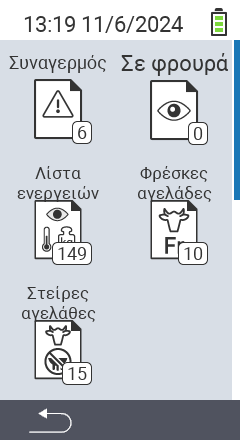

{}
Αν κάνετε κλικ σε ένα στοιχείο του μενού, θα ανακατευθυνθείτε σε μια περιγραφή της αντίστοιχης λειτουργίας.
{}

<map name="workmap">
  <area shape="rect" coords="3,40,116,160" alt="Λίστα συναγερμών" title="Ελέγξτε τη λίστα συναγερμών σας&#10;Κλικ με το ποντίκι: άνοιγμα τεκμηρίωσης" href="/el/docs/lists/alarm/">
  <area shape="rect" coords="3,160,116,280" alt="Λίστα δράσεων" title="Ελέγξτε τη λίστα δράσεων σας.&#10;Κλικ με το ποντίκι: άνοιγμα τεκμηρίωσης" href="/el/docs/lists/actions/">
  <area shape="rect" coords="3,280,116,399" alt="Λίστα ξηρών αγελάδων" title="Ελέγξτε τη λίστα ξηρών αγελάδων σας&#10;Κλικ με το ποντίκι: άνοιγμα τεκμηρίωσης" href="/el/docs/lists/dry-cows/">

  <area shape="rect" coords="116,40,230,160" alt="Λίστα παρακολούθησης" title="Ελέγξτε τη λίστα παρακολούθησης σας&#10;Κλικ με το ποντίκι: άνοιγμα τεκμηρίωσης" href="/el/docs/lists/on-watch/">
  <area shape="rect" coords="116,160,230,280" alt="Φρέσκες αγελάδες" title="Ελέγξτε τη λίστα φρέσκων αγελάδων σας&#10;Κλικ με το ποντίκι: άνοιγμα τεκμηρίωσης" href="/el/docs/lists/fresh-cows/">

  <area shape="rect" coords="2,401,115,438" alt="Πίσω" title="Πηδήξτε πίσω ένα επίπεδο" href="/el/docs/menu/mainmenu/">
</map>
