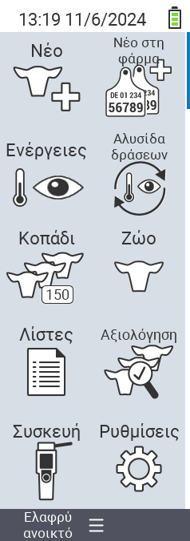

{}
Αν κάνετε κλικ σε ένα στοιχείο του μενού, θα μεταφερθείτε σε μια περιγραφή της αντίστοιχης λειτουργίας.
{}

<map name="workmap">
  <area shape="rect" coords="3,40,116,160" alt="Νέο" title="Δημιουργία νέων ζώων&#10;Κλικ με το ποντίκι: άνοιγμα τεκμηρίωσης" href="/el/docs/new/">
  <area shape="rect" coords="3,160,116,280" alt="Ενέργειες" title="Ενέργειες σε ζώα&#10;Κλικ με το ποντίκι: άνοιγμα τεκμηρίωσης" href="/el/docs/actions/">
  <area shape="rect" coords="3,280,116,400" alt="Κοπάδι" title="Μενού κοπαδιού&#10;Κλικ με το ποντίκι: άνοιγμα τεκμηρίωσης" href="/el/docs/herd/">
  <area shape="rect" coords="3,400,116,520" alt="Λίστες" title="Λίστες ζώων&#10;Κλικ με το ποντίκι: άνοιγμα τεκμηρίωσης" href="/el/docs/lists/">
  <area shape="rect" coords="3,520,116,634" alt="Συσκευή" title="Συσκευή&#10;Κλικ με το ποντίκι: άνοιγμα τεκμηρίωσης" href="/el/docs/device/">

  <area shape="rect" coords="116,40,230,160" alt="Νέο στη φάρμα" title="Πρόσβαση ζώων&#10;Κλικ με το ποντίκι: άνοιγμα τεκμηρίωσης" href="/el/docs/new-on-farm/">
  <area shape="rect" coords="116,160,230,280" alt="Αλυσίδα ενεργειών" title="Αλυσίδα ενεργειών&#10;Κλικ με το ποντίκι: άνοιγμα τεκμηρίωσης" href="/el/docs/chain-of-actions/">
  <area shape="rect" coords="116,280,230,400" alt="Ζώο" title="Ζώο&#10;Κλικ με το ποντίκι: άνοιγμα τεκμηρίωσης" href="/el/docs/animal/">
  <area shape="rect" coords="116,400,230,520" alt="Αξιολόγηση" title="Αξιολόγηση&#10;Κλικ με το ποντίκι: άνοιγμα τεκμηρίωσης" href="/el/docs/evaluation/">
  <area shape="rect" coords="116,520,230,634" alt="Ρυθμίσεις" title="Ρυθμίσεις&#10;Κλικ με το ποντίκι: άνοιγμα τεκμηρίωσης" href="/el/docs/settings/">
</map>
