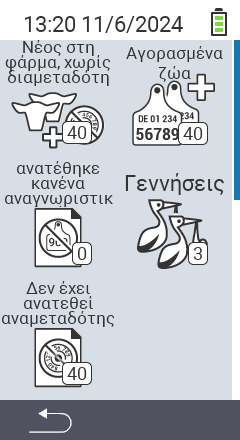

{}
Αν κάνετε κλικ σε ένα στοιχείο του μενού, θα μεταφερθείτε σε περιγραφή της αντίστοιχης λειτουργίας.
{}

<map name="workmap">
  <area shape="rect" coords="3,40,116,160" alt="Νέο στη φάρμα, χωρίς transponder" title="Εδώ αναθέτετε ένα transponder σε νέα ζώα χωρίς transponder&#10;Κλικ με το ποντίκι: άνοιγμα τεκμηρίωσης" href="/el/docs/new-on-farm/new-no-transponder/">
  <area shape="rect" coords="3,160,116,280" alt="Δεν έχει ανατεθεί εθνικός αριθμός ταυτότητας ζώου" title="Εδώ μπορείτε να δείτε όλα τα ζώα στα οποία δεν έχει ακόμη ανατεθεί εθνικός αριθμός ταυτότητας ζώου και να αναθέσετε έναν&#10;Κλικ με το ποντίκι: άνοιγμα τεκμηρίωσης" href="/el/docs/new-on-farm/no-national-animal-id-assigned/">
  <area shape="rect" coords="3,280,116,399" alt="Δεν έχει ανατεθεί transponder" title="Εδώ μπορείτε να δείτε όλα τα ζώα στα οποία δεν έχει ακόμη ανατεθεί transponder και να αναθέσετε ένα&#10;Κλικ με το ποντίκι: άνοιγμα τεκμηρίωσης" href="/el/docs/new-on-farm/no-transponder-assigned/">

  <area shape="rect" coords="116,40,230,160" alt="Αγορασμένα ζώα" title="Εδώ μπορείτε να δείτε τις τρέχουσες αγορές σας και να εξάγετε τα δεδομένα&#10;Κλικ με το ποντίκι: άνοιγμα τεκμηρίωσης" href="/el/docs/new-on-farm/purchased-animals/">
  <area shape="rect" coords="116,160,230,280" alt="Γεννήσεις" title="Εδώ μπορείτε να δείτε τις γεννήσεις σας και να δημιουργήσετε ένα αρχείο εξαγωγής&#10;Κλικ με το ποντίκι: άνοιγμα τεκμηρίωσης" href="/el/docs/new-on-farm/births/">
  <area shape="rect" coords="1,401,100,439" alt="Πίσω" title="Πηδήξτε πίσω ένα επίπεδο&#10;Κλικ με το ποντίκι: στην τεκμηρίωση" href="/el/docs/menu/mainmenu/">
</map>
