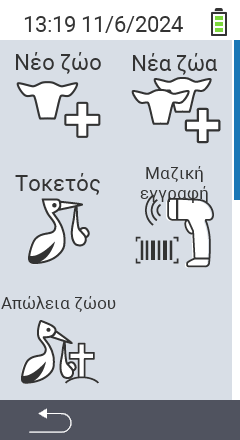

Μέσω του κύριου στοιχείου μενού  `Νέο` προχωράτε σε ένα υπομενού, όπου παρουσιάζονται 5 υποστοιχεία για επιλογή:

<map name="workmap">
  <area shape="rect" coords="3,40,116,160" alt="Νέο ζώο" title="Πώς να εγγράψετε ένα νέο ζώο χρησιμοποιώντας τη συσκευή VitalControl&#10;Κλικ με το ποντίκι: άνοιγμα τεκμηρίωσης" href="/el/docs/new/animal/">
  <area shape="rect" coords="3,160,116,280" alt="Γέννηση" title="Πώς να εγγράψετε μια νέα γέννηση χρησιμοποιώντας τη συσκευή VitalControl&#10;Κλικ με το ποντίκι: άνοιγμα τεκμηρίωσης" href="/el/docs/new/calving/">
  <area shape="rect" coords="3,280,116,399" alt="Απώλεια ζώου" title="Πώς να εγγράψετε την απώλεια ενός ζώου χρησιμοποιώντας τη συσκευή VitalControl&#10;Κλικ με το ποντίκι: άνοιγμα τεκμηρίωσης" href="/el/docs/new/animal-loss/">

  <area shape="rect" coords="116,40,230,160" alt="Νέα ζώα" title="Πώς να δημιουργήσετε πολλά νέα ζώα στη συσκευή VitalControl με μία μόνο ενέργεια&#10;Κλικ με το ποντίκι: άνοιγμα τεκμηρίωσης" href="/el/docs/new/animals/">
  <area shape="rect" coords="116,160,230,280" alt="Μαζική καταγραφή" title="Χρησιμοποιήστε το σαρωτή γραμμωτού κώδικα για να καταγράψετε μια ποικιλία ζώων&#10;Κλικ με το ποντίκι: άνοιγμα τεκμηρίωσης" href="/el/docs/new/bulk-recording/">

  <area shape="rect" coords="1,401,100,439" alt="Πίσω" title="Πηδήστε πίσω ένα επίπεδο&#10;Κλικ με το ποντίκι: στην τεκμηρίωση" href="/el/docs/menu/mainmenu/">
</map>

{}
Κάθε υπομενού φέρει το δικό του εικονίδιο. Μετακινήστε τον δείκτη του ποντικιού πάνω από ένα εικονίδιο στην παραπάνω γραφική παράσταση και αφήστε το για λίγο. Ένα εργαλείο εμφανίζεται, δείχνοντας πληροφορίες για το επιλεγμένο υπομενού. Αν κάνετε κλικ σε ένα από τα εικονίδια, θα μεταφερθείτε σε μια περιγραφή του επιλεγμένου στοιχείου υπομενού.
{}
