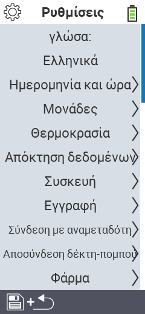

{}
Εάν κάνετε κλικ σε ένα στοιχείο του μενού, θα μεταφερθείτε σε μια περιγραφή της αντίστοιχης λειτουργίας.
{}

<map name="workmap">
  <area shape="rect" coords="2,40,230,120" alt="Γλώσσα" title="Ρυθμίστε και αποθηκεύστε μόνιμα τη γλώσσα του περιβάλλοντος χρήστη στη συσκευή σας VitalControl&#10;Κλικ ποντικιού: άνοιγμα τεκμηρίωσης" href="/el/docs/settings/language/">
  <area shape="rect" coords="2,120,230,160" alt="Ημερομηνία & Ώρα" title="Εδώ, ρυθμίζετε την ημερομηνία και την ώρα&#10;Κλικ ποντικιού: άνοιγμα τεκμηρίωσης" href="/el/docs/settings/datetime/">
  <area shape="rect" coords="2,160,230,200" alt="Μονάδες" title="Εδώ επιλέγετε μονάδες για τη θερμοκρασία και τη μάζα&#10;Κλικ ποντικιού: άνοιγμα τεκμηρίωσης" href="/el/docs/settings/units/">
  <area shape="rect" coords="2,200,230,240" alt="Θερμοκρασία" title="Ρυθμίστε τις ρυθμίσεις θερμοκρασίας για την εφαρμογή της συσκευής σας VitalControl&#10;Κλικ ποντικιού: άνοιγμα τεκμηρίωσης" href="/el/docs/settings/temperature/">
   <area shape="rect" coords="2,240,230,280" alt="Συλλογή δεδομένων" title="Εδώ αποθηκεύετε σχετικές πληροφορίες για τη συλλογή δεδομένων των ζώων&#10;Κλικ ποντικιού: άνοιγμα τεκμηρίωσης" href="/el/docs/settings/data-acquisition/">
   <area shape="rect" coords="2,280,230,320" alt="Συσκευή" title="Εδώ μπορείτε να προσαρμόσετε διάφορες ρυθμίσεις της συσκευής&#10;Κλικ ποντικιού: άνοιγμα τεκμηρίωσης" href="/el/docs/settings/device/">
   <area shape="rect" coords="2,320,230,360" alt="Εγγραφή ζώων" title="Εδώ μπορείτε να προσαρμόσετε διάφορα προκαθορισμένα πρότυπα σχετικά με την εγγραφή νέων ζώων στις απαιτήσεις της φάρμας σας.&#10;Κλικ ποντικιού: άνοιγμα τεκμηρίωσης" href="/el/docs/settings/animal-registration/">
   <area shape="rect" coords="2,360,230,400" alt="Σύνδεση τρανσπόντερ" title="Ρυθμίστε την ανάθεση του τρανσπόντερ στη συσκευή σας VitalControl&#10;Κλικ ποντικιού: άνοιγμα τεκμηρίωσης" href="/el/docs/settings/transponder-linkage/">
   <area shape="rect" coords="2,400,230,439" alt="Αποσύνδεση τρανσπόντερ" title="Καθορίστε πώς θα ανατεθεί ο αριθμός ταυτότητας του ζώου αφού αποσυνδεθεί το τρανσπόντερ&#10;Κλικ ποντικιού: άνοιγμα τεκμηρίωσης" href="/el/docs/settings/transponder-linkage/">
   <area shape="rect" coords="2,440,230,480" alt="Φάρμα" title="Αποθηκεύστε μόνιμα τον επίσημο δωδεκαψήφιο εθνικό αριθμό της φάρμας σας στη συσκευή VitalControl&#10;Κλικ ποντικιού: άνοιγμα τεκμηρίωσης" href="/el/docs/settings/farm-number/">
   <area shape="rect" coords="2,482,123,519" alt="Πίσω" title="Πηδήστε πίσω ένα επίπεδο" href="/el/docs/menu/mainmenu/">
</map>
