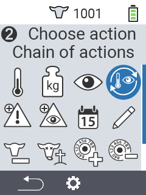
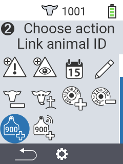
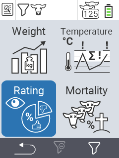


<a class="btn btn-lg btn-primary me-3 mb-4" href="#td-block-2">
  Learn more <i class="fas fa-arrow-alt-circle-right ms-2"></i>
</a>
<a class="btn btn-lg btn-secondary me-3 mb-4" href="/docs/">
  Documentation<i class="fa-solid fa-book ms-2 "></i>
</a>

Health management at the highest level!




{}

**Reduce** the **paperwork**  

**Increase** your **animal health**

Have **everything** at **glance**   

With just **one device**     
{}


{}
 

    

    <button type="button" data-bs-target="#carouselLanguageIndicators" data-bs-slide-to="0" class="active" aria-current="true" aria-label="German"></button>
    <button type="button" data-bs-target="#carouselLanguageIndicators" data-bs-slide-to="1" aria-label="English"></button>
    <button type="button" data-bs-target="#carouselLanguageIndicators" data-bs-slide-to="2" aria-label="Dutch"></button>
    <button type="button" data-bs-target="#carouselLanguageIndicators" data-bs-slide-to="3" aria-label="Finish"></button>
    <button type="button" data-bs-target="#carouselLanguageIndicators" data-bs-slide-to="4" aria-label="French"></button>
    <button type="button" data-bs-target="#carouselLanguageIndicators" data-bs-slide-to="5" aria-label="Russian"></button>
    <button type="button" data-bs-target="#carouselLanguageIndicators" data-bs-slide-to="6" aria-label="Spanish"></button>
    <button type="button" data-bs-target="#carouselLanguageIndicators" data-bs-slide-to="7" aria-label="Bosnian"></button>
    <button type="button" data-bs-target="#carouselLanguageIndicators" data-bs-slide-to="8" aria-label="Bulgarian"></button>
    <button type="button" data-bs-target="#carouselLanguageIndicators" data-bs-slide-to="9" aria-label="Chinese"></button>
    <button type="button" data-bs-target="#carouselLanguageIndicators" data-bs-slide-to="10" aria-label="Czech"></button>
    <button type="button" data-bs-target="#carouselLanguageIndicators" data-bs-slide-to="11" aria-label="Norwegian"></button>
    <button type="button" data-bs-target="#carouselLanguageIndicators" data-bs-slide-to="12" aria-label="Greek"></button>
    <button type="button" data-bs-target="#carouselLanguageIndicators" data-bs-slide-to="13" aria-label="Turkish"></button>
    <button type="button" data-bs-target="#carouselLanguageIndicators" data-bs-slide-to="14" aria-label="Ukrainian"></button>
    <button type="button" data-bs-target="#carouselLanguageIndicators" data-bs-slide-to="15" aria-label="Estonian"></button>
    
 

    

      

        <h3>German</h3>
      

      
    

    

      

        <h3>Dutch</h3>
      

      
    

    

      

        <h3>English</h3>
      

      
    

    

      

        <h3>Finnish</h3>
      

      
    

    

      

        <h3>French</h3>
      

      
    

    

      

        <h3>Russian</h3>
      

    
    
  
    

      

        <h3>Spanish</h3>
      

    
    

      

        

          <h3>Bosnian</h3>
        

      
      

      

        

          <h3>Bulgarian</h3>
        

      
      

      

        

          <h3>Chinese</h3>
        

      
      

      

        

          <h3>Czech</h3>
        

      
      

      

        

          <h3>Norwegian</h3>
        

      
      

      

        

          <h3>Greek</h3>
        

      
      
      
      

        

          <h3>Turkish</h3>
        

      
      
 
      

        

          <h3>Ukrainian</h3>
        

      
      
 
      

        

          <h3>Estonian</h3>
        

      
      
 
  

  <button class="carousel-control-prev" type="button" data-bs-target="#carouselLanguagesAutoplaying" data-bs-slide="prev" style="left: 0px; top: 37px; height: 320px;">
    
    Previous
  </button>
  <button class="carousel-control-next" type="button" data-bs-target="#carouselLanguagesAutoplaying" data-bs-slide="next" style="right: 0px; top: 37px; height: 320px;">
    
    Next
  </button>

{}

{}
 

    

    <button type="button" data-bs-target="#carouselActionsIndicators" data-bs-slide-to="0" class="active" aria-current="true" aria-label="Temperature"></button>
    <button type="button" data-bs-target="#carouselActionsIndicators" data-bs-slide-to="1" aria-label="Weighing"></button>
    <button type="button" data-bs-target="#carouselActionsIndicators" data-bs-slide-to="2" aria-label="Rating"></button>
    <button type="button" data-bs-target="#carouselActionsIndicators" data-bs-slide-to="3" aria-label="Chain of actions"></button>
    <button type="button" data-bs-target="#carouselActionsIndicators" data-bs-slide-to="4" aria-label="Alarm"></button>
    <button type="button" data-bs-target="#carouselActionsIndicators" data-bs-slide-to="5" aria-label="On watch"></button>
    <button type="button" data-bs-target="#carouselActionsIndicators" data-bs-slide-to="6" aria-label="Animal´s history"></button>
    <button type="button" data-bs-target="#carouselActionsIndicators" data-bs-slide-to="7" aria-label="Edit"></button>
    <button type="button" data-bs-target="#carouselActionsIndicators" data-bs-slide-to="8" aria-label="Unregister"></button>
    <button type="button" data-bs-target="#carouselActionsIndicators" data-bs-slide-to="9" aria-label="Animal loss"></button>
    <button type="button" data-bs-target="#carouselActionsIndicators" data-bs-slide-to="10" aria-label="Link transponder"></button>
    <button type="button" data-bs-target="#carouselActionsIndicators" data-bs-slide-to="11" aria-label="Unlink transponder"></button>
    <button type="button" data-bs-target="#carouselActionsIndicators" data-bs-slide-to="12" aria-label="Link animal ID"></button>
    <button type="button" data-bs-target="#carouselActionsIndicators" data-bs-slide-to="13" aria-label="Link electronic animal ID"></button>
  

    

      

        <h3>Temperature</h3>
      

      
    

    

      

        <h3>Weighing</h3>
      

      
    

    

      

        <h3>Rating</h3>
      

      
    

    

      

        <h3>Chain of actions</h3>
      

      
    

    

      

        <h3>Alarm</h3>
      

      
    

    

      

        <h3>On watch</h3>
      

      
    

    

      

        <h3>Animal´s history</h3>
      

      
    

    

      

        <h3>Edit</h3>
      

      
    

    

      

        <h3>Unregister</h3>
      
      

    

    

      

        <h3>Animal loss</h3>
      

      
    

    

      

        <h3>Link transponder</h3>
      

      
    

    

      

        <h3>Unlink transponder</h3>
      

      
    
      
    

      

        <h3>Link animal ID</h3>
      

      
    
   
    

      

        <h3>Link animal ID</h3>
      

      
    
             
  

  <button class="carousel-control-prev" type="button" data-bs-target="#carouselActionsAutoplaying" data-bs-slide="prev" style="left: 0px; top: 37px; height: 320px;">
    
    Previous
  </button>
  <button class="carousel-control-next" type="button" data-bs-target="#carouselActionsAutoplaying" data-bs-slide="next" style="right: 0px; top: 37px; height: 320px;">
    
    Next
  </button>

{}

{}
 

    

    <button type="button" data-bs-target="#carouselListsIndicators" data-bs-slide-to="0" class="active" aria-current="true" aria-label="Alarm"></button>
    <button type="button" data-bs-target="#carouselListsIndicators" data-bs-slide-to="1" aria-label="On Watch"></button>
    <button type="button" data-bs-target="#carouselListsIndicators" data-bs-slide-to="2" aria-label="Action"></button>
    <button type="button" data-bs-target="#carouselListsIndicators" data-bs-slide-to="3" aria-label="Fresh cows"></button>
    <button type="button" data-bs-target="#carouselListsIndicators" data-bs-slide-to="4" aria-label="Dry cows"></button>
  

    

      

        <h3>Alarm</h3>
      

      
    

    

      

        <h3>On watch</h3>
      

      
    

    

      

        <h3>Action list</h3>
      
      
      
    

    

      

        <h3>Fresh cows</h3>
      

      
    

    

      

        <h3>Dry cows</h3>
      

    
    

  

  <button class="carousel-control-prev" type="button" data-bs-target="#carouselListsAutoplaying" data-bs-slide="prev" style="left: 0px; top: 37px; height: 320px;">
    
    Previous
  </button>
  <button class="carousel-control-next" type="button" data-bs-target="#carouselListsAutoplaying" data-bs-slide="next" style="right: 0px; top: 37px; height: 320px;">
    
    Next
  </button>

{}

{}
 

    

    <button type="button" data-bs-target="#carouselListsIndicators" data-bs-slide-to="0" class="active" aria-current="true" aria-label="Evaluation weight"></button>
    <button type="button" data-bs-target="#carouselListsIndicators" data-bs-slide-to="1" aria-label="Evaluation temperature"></button>
    <button type="button" data-bs-target="#carouselListsIndicators" data-bs-slide-to="2" aria-label="Evaluation rating"></button>
    <button type="button" data-bs-target="#carouselListsIndicators" data-bs-slide-to="3" aria-label="Evaluation mortality"></button>
  

    

      

        <h3>Weight</h3>
      
 
      
    

    

      

        <h3>Temperature</h3>
      
 
      
    

    

      

        <h3>Rating</h3>
      
 
      
    

    

      

        <h3>Mortality</h3>
      
 
      
    

  

  <button class="carousel-control-prev" type="button" data-bs-target="#carouselEvaluationAutoplaying" data-bs-slide="prev" style="left: 0px; top: 37px; height: 320px;">
    
    Previous
  </button>
  <button class="carousel-control-next" type="button" data-bs-target="#carouselEvaluationAutoplaying" data-bs-slide="next" style="right: 0px; top: 37px; height: 320px;">
    
    Next
  </button>

{}


{}

Suitable for several **types of animals** at different **ages**

{}


{}
 

 
{}

{}
 

 
{}

{}
 

 
{}



{}

Our **highlights** for you

{}


{}
 

 
{}

{}
 

 
{}

{}
 

 
{}

{}
 

 
{}



{}
Urban in social networks

{}

{}

{}
{}

{}
{}

{}
{}

{}
{}


