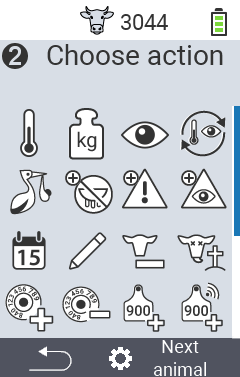

## Available actions {#available-actions}

Depending on the animal type, you can perform up to 16 different actions for an animal.

<map name="workmap">
  <area shape="rect" coords="3,100,60,165" alt="Temperature" title="Measure fever in your animals&#10;Mouse click: open documentation" href="/en/docs/actions/measure-temperature/">
  <area shape="rect" coords="60,100,118,165" alt="Weighing" title="Record the weight of your animals&#10;Mouse click: open documentation" href="/en/docs/actions/record-weight/">
  <area shape="rect" coords="118,100,174,165" alt="Rating" title="Rate your animals&#10;Mouse click: open documentation" href="/en/docs/actions/rating/">
  <area shape="rect" coords="174,100,230,165" alt="Chain of actions" title="Applying and setting the chain of action&#10;Mouse click: open documentation" href="/en/docs/chain-of-actions/">
   <area shape="rect" coords="3,165,60,225" alt="Calving" title="Register a calving&#10;Mouse click: open documentation" href="/en/docs/actions/calving/">
   <area shape="rect" coords="60,165,120,225" alt="Dry off" title=" Dry off a cow or add her to the fresh cows list&#10;Mouse click: open documentation" href="/en/docs/actions/dry-off/">
   <area shape="rect" coords="120,165,175,225" alt="Alarm" title="Add and remove animals from the alarm list&#10;Mouse click: open documentation" href="/en/docs/actions/alarm/">
   <area shape="rect" coords="175,165,230,225" alt="On watch" title="Put animals on the on-watch list or remove them&#10;Mouse click: open documentation" href="/en/docs/actions/on-watch/">
   <area shape="rect" coords="3,225,60,280" alt="Animal history" title="View an animal’s history&#10;Mouse click: open documentation" href="/en/docs/actions/animal-history/">
   <area shape="rect" coords="60,225,120,280" alt="Edit" title="Edit data of the selected animal&#10;Mouse click: open documentation" href="/en/docs/actions/edit/">
   <area shape="rect" coords="120,225,175,280" alt="Unregister" title="Unregister an animal&#10;Mouse click: open documentation" href="/en/docs/actions/unregister/">
   <area shape="rect" coords="175,225,230,280" alt="Animal loss" title="Register an animal loss&#10;Mouse click: open documentation" href="/en/docs/actions/animal-loss/">
   <area shape="rect" coords="3,280,60,337" alt="Link transponder" title="Assign a transponder to an animal&#10;Mouse click: open documentation" href="/en/docs/actions/link-transponder/">
   <area shape="rect" coords="55,280,120,337" alt="Unlink transponder" title="Remove the transponder link to an animal&#10;Mouse click: open documentation" href="/en/docs/actions/unlink-transponder/">
   <area shape="rect" coords="120,280,175,337" alt="Link animal ID manually" title="Assign a national animal ID to an animal that does not have a national animal ID&#10;Mouse click: open documentation" href="/en/docs/actions/link-animal-id/#link-animal-id">
   <area shape="rect" coords="175,280,230,337" alt="Link animal ID with scan" title="Assign a national animal ID to an animal that does not have a national animal ID&#10;Mouse click: open documentation" href="/en/docs/actions/link-animal-id/#link-animal-id-with-electronic-ear-tag-scan">

   <area shape="rect" coords="100,340,140,375" alt="Settings" title="Call up the settings&#10;Mouse click: to the documentation" href="/en/docs/actions/setting/">
</map>

{}
Each action is identified by a symbol. Move the mouse pointer over a symbol in the graphic below and let it rest for a moment. A tooltip appears, presenting information about the respective action. If you click on one of the symbols, you will be forwarded to a description of the respective action.
{}

## General procedure {#general-procedure}

Within the menu   `` you can select the next animal at any time without having to leave the menu item Actions. To select the next animal, proceed as follows:

1. Select the menu item   `` on the main screen of your VitalControl device and press the `` button.

2. Either scan an animal using the transponder or select an animal from the list. Confirm by pressing `` and select an animal using the arrow buttons △ ▽. Confirm with ``.

3. A submenu opens in which you will find icons for numerous animal actions. Use the arrow buttons to select the desired action and start the action by pressing the `` button. Depending on the action selected, one or more screens or a pop-up window will appear.

4. If desired, you can now select and execute another action for the current animal.

5. After you have carried out the desired action(s) for the animal, return to step 2 'Animal selection'. To do this, press the left-hand button `F1` below the ` symbol in the bottom left-hand corner of the footer.

6. The window from step two will open again automatically and you can select the next animal or return to the main menu by pressing the `F1` button below the ` symbol.



{}

{}
{}

{}

