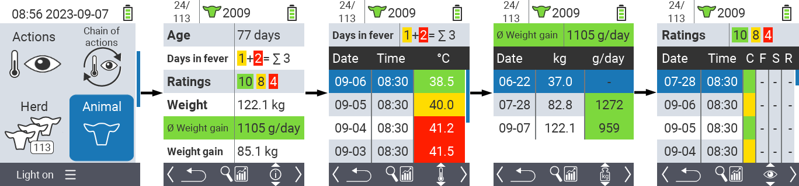
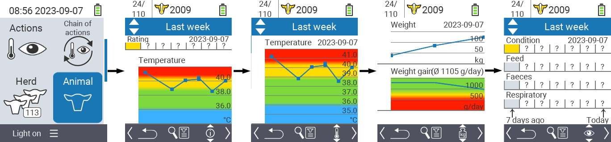
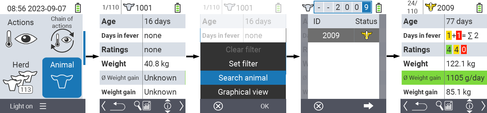
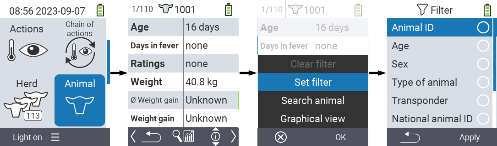

## Animal

The individual animal function allows you to view important information about weight, temperature and rating for each individual animal. You always have the option of displaying the information as a graphic or as a list. To use the single animal function, proceed as follows:

1. On the main screen of your VitalControl device, select the menu item  `Animal` and press the `OK` button.

2. An overview of the most important animal information opens. The upper edge of the screen shows you which animal you are currently viewing. Use the `F3` key to choose between animal information , temperature , weight   and rating .

 

{}
Within each information display you have the option of [searching for an animal](#search-animal), setting a [filter](#set-filter) and switching to a [graphical view](#set-graphical-view).
You can also switch between the individual animals at any time using the arrow keys ◁ ▷.
{}

### Set graphical view

1. Use the  `On/Off` button. A submenu opens. you can choose between `Set filter`, `Search animal`, `Graphical view`.

2. Select `Graphical view` with the arrow keys △ ▽ and confirm with `OK`.

 

### Search animal

1. Use the  `On/Off` button. A submenu opens. you can choose between `Set filter`, `Search animal`, `Graphical view`.

2. Select `Search animal` with the arrow keys △ ▽ and confirm with `OK`.

3. Use the arrow keys △ ▽ ◁ ▷ to select the desired animal number and confirm with `OK`

 

### Set filter

1. Use the  `On/Off` button. A submenu opens. you can choose between `Set filter`, `Search animal`, `Graphical view`.

2. Select `Set filter` with the arrow keys △ ▽ and confirm with `OK`.
You can find out how to use the filter [here](../filter).

 
