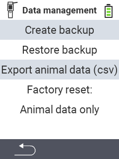

{}
If you click on a menu item, you will be redirected to a description of the respective function.
{}

<map name="workmap">
  <area shape="rect" coords="2,40,238,80" alt="Create backup" title="The instructions for creating a backup can be found here&#10;Mouse click: open documentation" href="/en/docs/backup/backup/">
  <area shape="rect" coords="2,80,238,120" alt="Restore backup" title="The instructions for restore a backup can be found here&#10;Mouse click: open documentation" href="/en/docs/backup/restore/">
  <area shape="rect" coords="2,120,238,160" alt="Export animal data" title="All information and instructions for exporting animal data can be found here&#10;Mouse click: open documentation" href="/en/docs/data-export/usb-drive/">
  <area shape="rect" coords="2,160,238,240" alt="Factory reset" title="All information and instructions for resetting the device and the animal data can be found here&#10;Mouse click: open documentation" href="/docs/reset/">
</map>
