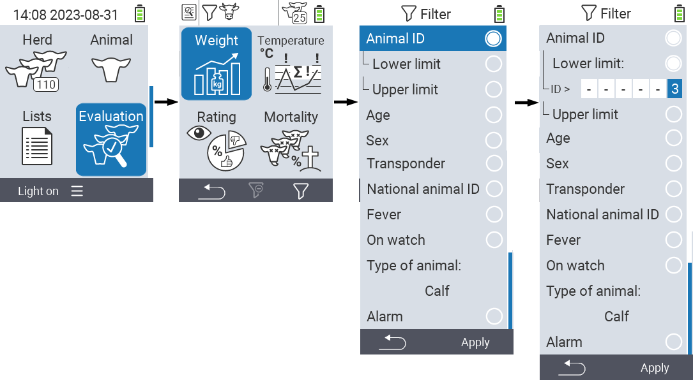
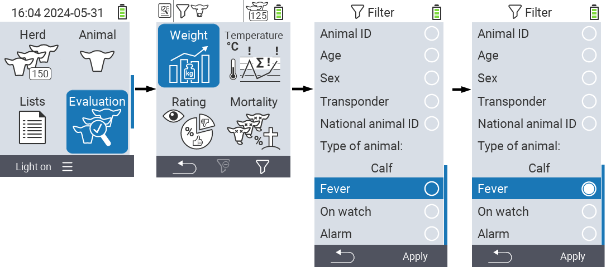

## Applying filters

{}
The filter helps you to carry out a selection using filter criteria within the menu items `Herd`, `Lists` and `Evaluation` of the VitalControl device. As soon as you apply a filter, symbols for the various filter criteria appear at the top of the screen. These symbols are used to help you find out whether and which filter criteria are activated. For example, if you set the `Sex` filter to male, the device will only use male animals. For example, if you also activate the `On watch` filter, the device only uses male animals that are on the observation list.
{}

To create a filter in the evaluations, proceed as follows:

1. Press the `F3` key  once in the menu item  `Evaluation` and twice in the menu items  `Lists` and  `Herd`.

2. A submenu opens in which you can set all filter options. You can filter by `Animal ID`, `Age`, `Sex`, `Transponder`, `National animal ID`, `Fever`, `On watch`, `Type of animal` and `Alarm`.

3. For the filters `Type of animal`, `Sex`, `Transponder` and `National animal ID` navigate to the corresponding area and confirm with `OK`. Use the arrow keys ◁ ▷ to specify the desired setting. Use `F3` key `Apply` to put the selected setting in place. To discard your filter changes, press `F1` key &nbsp;&nbsp;.

   

4. For the filters `Animal ID` and `Age` select the corresponding criterion and confirm with `OK`. You will now be shown a lower and upper limit. Navigate to the desired limit using the arrow keys △ ▽ and confirm by pressing `OK` twice. Now you can set the desired number using the arrow keys ◁ ▷ and arrow keys △ ▽. Once all settings are correct press `OK` again to leave the setting mode and apply the selected filter(s) with `F3` key `Apply`. Using the `F1` key &nbsp;&nbsp;, you can discard your changes if desired.

   

5. For the filters `Fever`, `On watch` and `Alarm` there is a possibility to disable or enable their application. To do this, select the corresponding filter and confirm with `OK`. The filter is now active. Confirm again with `OK` to deactivate the filter.

   

6. Once you have set all the filters, use the `F3` key `Apply` to put the defined filters in place or press `F1` key  to discard your changes to the filter(s).
